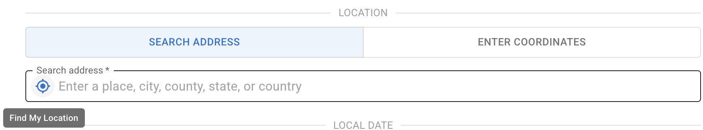
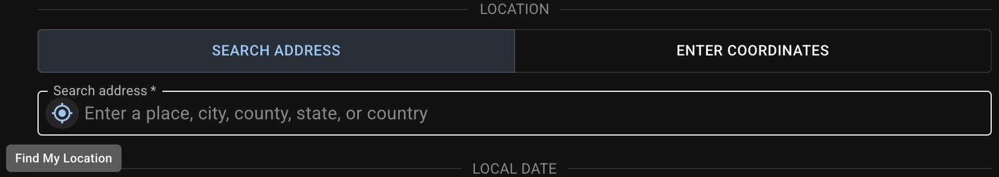

The **geographic coordinates** will be used to determine the observer's local [horizontal coordinate system][].

There are three ways to specify the location as follows.

[horizontal coordinate system]: https://en.wikipedia.org/wiki/Horizontal_coordinate_system

## Find My Location {#gps}

In the `SEARCH ADDRESS` tab, click the GPS icon in the search bar to find the address of the current location. This step will also assign the **coordinates** of this location.
If the GPS fails, the IP location will be used as a fallback.
{ .img-light } { .img-dark }

## Search Address {#search-address}

{ .img-light } { .img-dark }

After setting up an address, the **latitude** and **longitude** values will be stored in the background. If you switch to the `ENTER COORDINATES` tab right after selecting an address, you'll see that the coordinates are filled out already. Note that if you switch back to `SEARCH ADDRESS`, the address and coordinates will be both cleared.
{ .img-light } { .img-dark }

::: card "Geocoding Service in Use"
The default geocoding service is [Nominatim][] using [OpenStreetMap][] data. Within the Great Firewall of China (GFW), [Tianditu][] will be used for reverse geocoding and [QQ LBS service][] will be used for searching as Nominatim is inaccessible. In this case, we recommend using Chinese search terms for better results.
{ .img-light } { .img-dark }

::: callout warning
When using QQ LBS service, addresses are displayed in Simplified Chinese. Traditional Chinese display is currently not supported.
:::

The geocoding service is automatically determined and cached when the page loads. If you see an incorrect service is in use, please check the system time zone, clear cache, then refresh the page and try again.

[Nominatim]: https://nominatim.org/release-docs/latest/api/Overview/
[OpenStreetMap]: https://www.openstreetmap.org/
[Tianditu]: http://lbs.tianditu.gov.cn/server/guide.html
[QQ LBS service]: https://lbs.qq.com/service/webService/webServiceGuide/webServiceOverview

:::

## Enter Latitude and Longitude Manually {#enter-lat-lng}

You can always choose to directly enter the `Latitude` and `Longitude` in decimal degrees in the `ENTER COORDINATES` tab.
