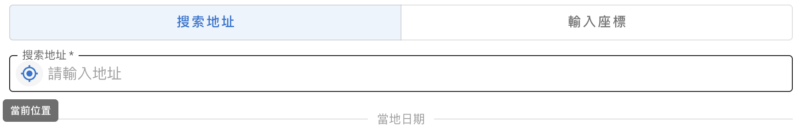
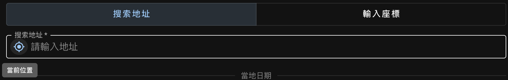
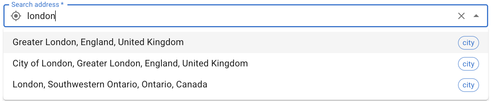
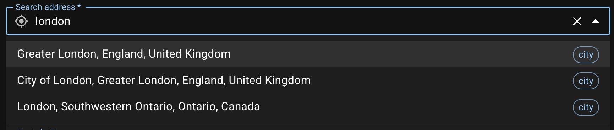
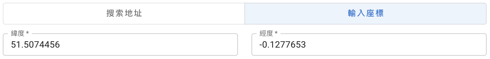
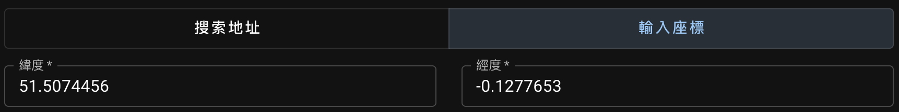
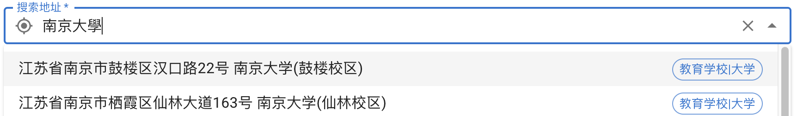
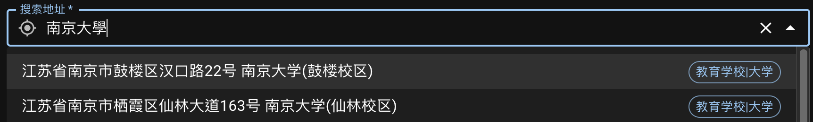

觀測者的**地理座標**用來確定當地的[地平座標系][horizontal coordinate system]。這個位置可通過以下三種方式指定。

[horizontal coordinate system]: https://zh.wikipedia.org/wiki/%E5%9C%B0%E5%B9%B3%E5%9D%90%E6%A8%99%E7%B3%BB

## 定位當前位置 {#gps}

在`搜索地址`模式，點擊按鈕進行定位。這一步會自動設定**經緯度**。如果定位失敗，將自動使用 IP 地址獲得粗略的經緯度。
{ .img-light } { .img-dark }

## 搜索地址 {#search-address}

{ .img-light } { .img-dark }

確定地址後，後台將同時記錄得到的經緯度數據。此時如果切換到`輸入座標`模式，會發現經緯度已經填好了。
需要注意的是如果此時再次切回`搜索地址`模式，地理位置信息將被清空。
{ .img-light } { .img-dark }

::: card "地理位置服務"
境外的默認地理位置服務是 [Nominatim][]，使用開放地圖數據 [OpenStreetMap][]。 在牆內將使用[天地圖][Tianditu]進行定位以及[騰訊位置服務][QQ LBS service]進行搜索。這種情況推薦使用中文搜索以得到相對準確的結果。
{ .img-light } { .img-dark }

::: callout warning
使用騰訊位置服務時，地址選項將顯示為簡體中文，暫不支持以繁體中文顯示。
:::

應用啟動時會自動判斷使用何種服務。如果發現自動選擇的服務有誤，請檢查系統時區、清空緩存然後刷新頁面重試。

[Nominatim]: https://nominatim.org/release-docs/latest/api/Overview/
[OpenStreetMap]: https://www.openstreetmap.org/
[Tianditu]: http://lbs.tianditu.gov.cn/server/guide.html
[QQ LBS service]: https://lbs.qq.com/service/webService/webServiceGuide/webServiceOverview

:::

## 手動輸入經緯度 {#enter-lat-lng}

您可以隨時選擇`輸入座標`模式，通過手動輸入十進制小數的經緯度來指定地點。
