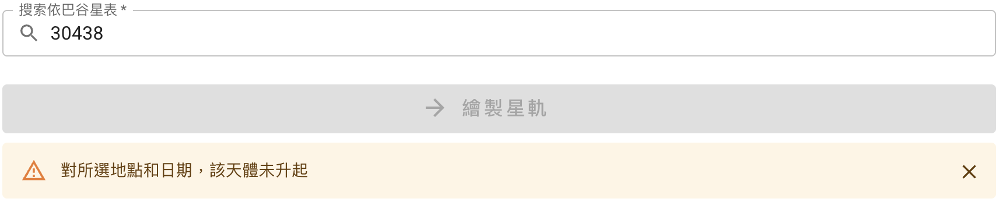
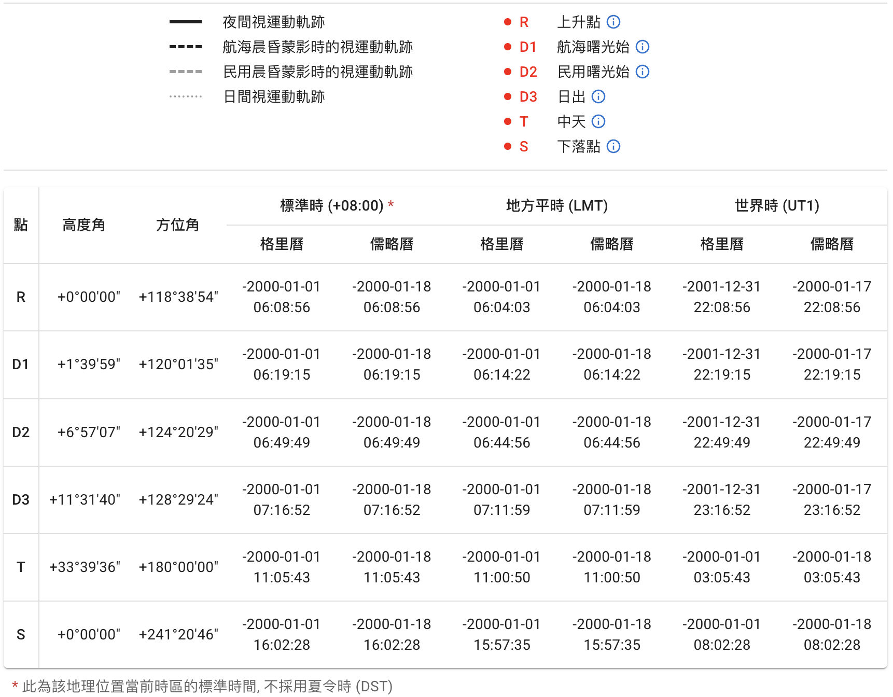
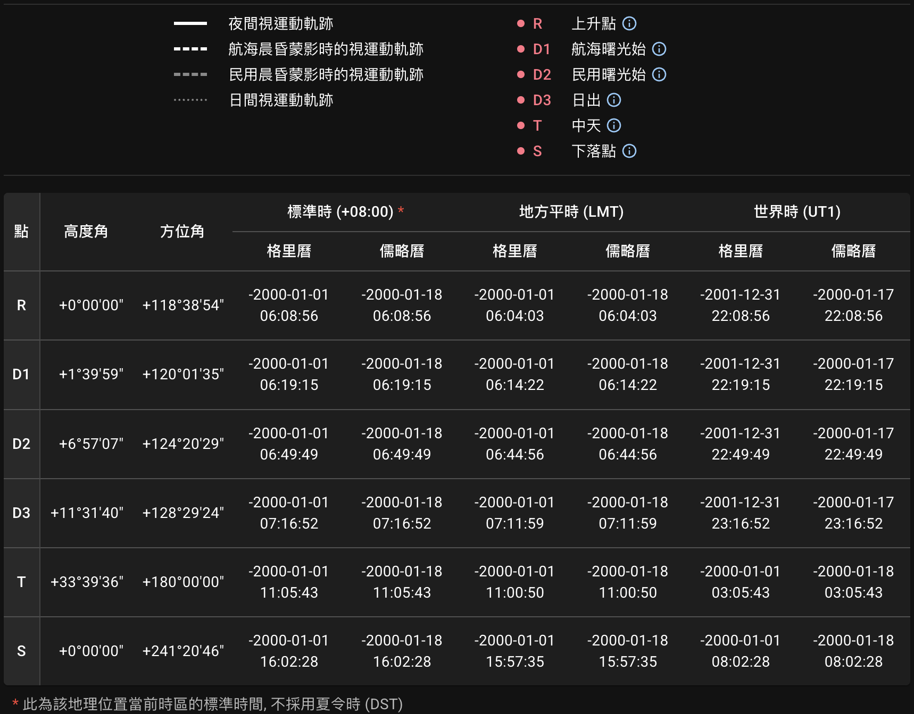

## 地平座標投影圖 {#diagram}

點擊`繪製星軌`按鈕發送請求後，服務器會以圖片和表格形式返回結果。查詢的地點、日期、天體等信息將同時顯示在圖像上方。

::: callout info "關於速度"
由於這是一個非商用的開源項目，我們服務器的搭載使用的是免費計劃。因此，連接和運算時間偶爾會比預計長一些，但通常最多等待幾秒鐘即可獲得結果。
:::

天體的視運動軌跡投影在[地平座標系][horizontal coordinate system]上。該座標系的兩個獨立座標分別為**高度角**（地平緯度）和**方位角**（地平經度）。圖中最外圈表示地平線。[南北天極][north and south celestial poles]和[天頂][zenith]如果在座標範圍內，將分別標記為 `NCP`、`SCP` 和 `Z`。
{ .img-light .size-large } { .img-dark .size-large }

::: callout info "如果天體未升起"
如果對所選地點和日期，查詢的天體未曾升起，將顯示提示：
{ .img-light } { .img-dark }
:::

### 農曆日期 {#chinese-calendar-tooltip}

如果查詢的日期可被轉換為農曆，該農曆日期將顯示為浮動提示。光標懸停在格里曆或儒略曆日期上（在移動端則輕觸）即可看到提示。
{ .img-light } { .img-dark }

[horizontal coordinate system]: https://zh.wikipedia.org/wiki/%E5%9C%B0%E5%B9%B3%E5%9D%90%E6%A8%99%E7%B3%BB
[north and south celestial poles]: https://zh.wikipedia.org/wiki/%E5%A4%A9%E6%A5%B5
[zenith]: https://zh.wikipedia.org/wiki/%E5%A4%A9%E9%A0%82

## 圖例與座標時刻表 {#legend-and-table}

圖中的星軌根據不同晨昏階段使用不同線型繪製加以區分。所選天體在升落和中天的位置也標記在圖中。圖片下方附帶了圖例和數據表格供參考。表格中包含了這些標記點的相應座標和時刻。
{ .img-light } { .img-dark }

::: callout tip "標記點説明"
光標懸停在 **ⓘ** 符號上（在移動端則輕觸）可打開相應標記點的解釋。參見[慣例約定][Conventions]部分。
{ .img-light } { .img-dark }

[Conventions]: ../conventions/

:::

::: callout tip "地方平時"
表格中的[地方平時（LMT）][LMT]直接由觀測地經緯度計算得出。

關於**標準時**，參見[時區][Time Zone]部分的説明。

[LMT]: https://zh.wikipedia.org/wiki/%E5%9C%B0%E6%96%B9%E5%B9%B3%E6%99%82
[Time Zone]: ../conventions/#time-zone

:::

::: callout info "大氣折射（蒙氣差）"
計算天體位置時考慮了[大氣折射][atmospheric refraction]效應。更多細節參見[計算高度角][Altitude Calculation]部分。

[atmospheric refraction]: https://zh.wikipedia.org/wiki/%E5%A4%A7%E6%B0%A3%E6%8A%98%E5%B0%84
[Altitude Calculation]: ../conventions/#altitude-calculation

:::

## 導出結果 {#export}

生成的圖像可導出為 `SVG`、`PNG` 或 `PDF` 格式。表格可導出為 `CSV`、`JSON` 或 `XLSX` 格式。文件名中的數字（例如`1777589177.716`）為生成結果時的 Unix 時間戳，並且在導出的圖片和表格文件名中是一致的。

::: card "元數據"
查詢信息將以**元數據**的形式嵌入 `SVG` 文件：

```xml
<metadata>
  <title>sp_1777589177.716</title>
  <desc>Date (Gregorian): +2000-01-01</desc>
  <desc>Location (lat/lng): 32.055/118.779</desc>
  <desc>Celestial Object: Jupiter</desc>
</metadata>
```

或嵌入 `PDF` 文檔屬性的 `描述` 部分：

```text
Location (lat/lng): 32.055/118.779,
Date (Gregorian): +2000-01-01,
Celestial Object: Jupiter
```

:::
