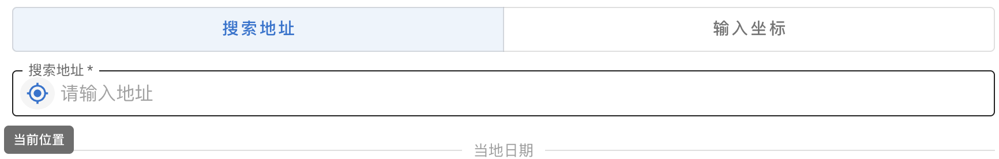
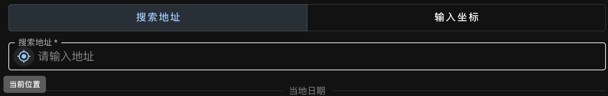
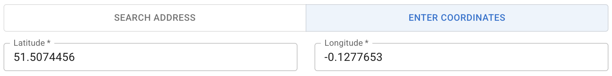
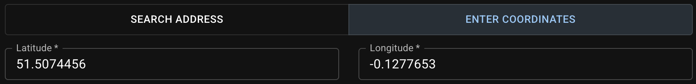
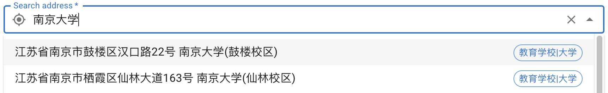
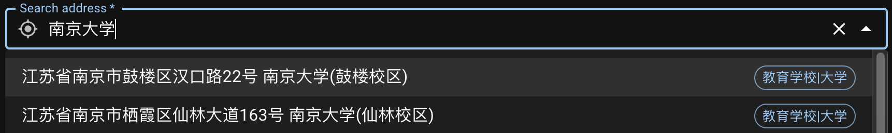

观测者的**地理坐标**用来确定当地的[地平坐标系][horizontal coordinate system]。这个位置可通过以下三种方式指定。

[horizontal coordinate system]: https://zh.wikipedia.org/wiki/%E5%9C%B0%E5%B9%B3%E5%9D%90%E6%A8%99%E7%B3%BB

## 定位当前位置 {#gps}

在`搜索地址`模式，点击按钮进行定位。这一步会自动设定**经纬度**。如果定位失败，将自动使用 IP 地址获得粗略的经纬度。
{ .img-light } { .img-dark }

## 搜索地址 {#search-address}

{ .img-light } { .img-dark }

确定地址后，后台将同时记录得到的经纬度数据。此时如果切换到`输入坐标`模式，会发现经纬度已经填好了。
需要注意的是如果此时再次切回`搜索地址`模式，地理位置信息将被清空。
{ .img-light } { .img-dark }

::: card "地理位置服务"
在境外访问时默认的地理位置服务是 [Nominatim][]，使用开放地图数据 [OpenStreetMap][]。 在墙内访问时将使用[天地图][Tianditu]进行定位以及[腾讯位置服务][QQ LBS service]进行搜索。这种情况下推荐使用中文搜索以得到更准确的结果。
{ .img-light } { .img-dark }

::: callout warning
使用腾讯位置服务时，地址选项将显示为简体中文，暂不支持以繁体中文显示。
:::

应用启动时会自动判断使用何种服务。如果发现自动选择的服务有误，请检查系统时区、清空缓存然后刷新页面重试。

[Nominatim]: https://docs.google.com/document/d/11LUy0wN44GcyYeCPPVCRmK9fMd8YHUEqMziP1tXX6h8/edit?tab=t.u3psio845x3b#heading=h.cpt3dlgbt6in
[OpenStreetMap]: https://www.openstreetmap.org/
[Tianditu]: http://lbs.tianditu.gov.cn/server/guide.html
[QQ LBS service]: https://lbs.qq.com/service/webService/webServiceGuide/webServiceOverview

:::

## 手动输入经纬度 {#enter-lat-lng}

您可以随时选择`输入坐标`模式，通过手动输入十进制小数的经纬度来指定地点。
