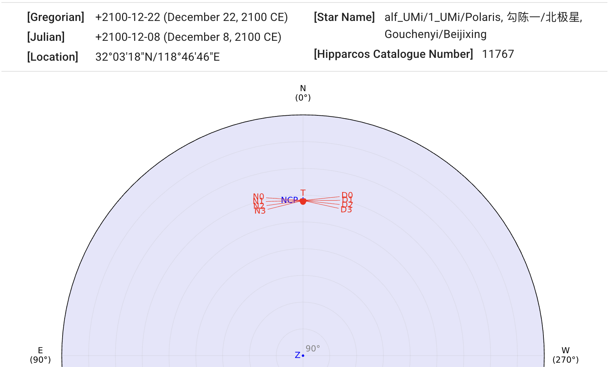
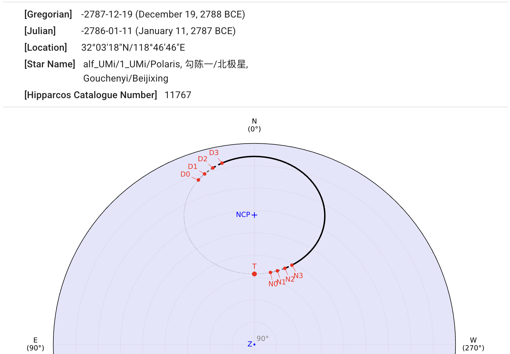
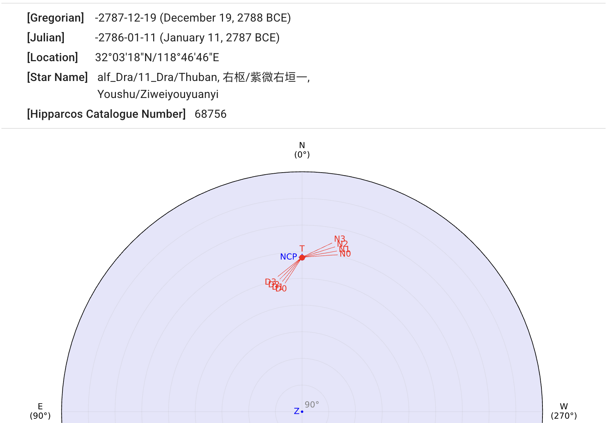

## North Star

::: collapsible "α Ursae Minoris in 2100 CE"

α Ursae Minoris (Polaris) is the current North Star.
{ .img-light } { .img-dark }
:::

::: collapsible "α Ursae Minoris in 2787 BCE"

α Ursae Minoris was not the North Star at that time.
{ .img-light } { .img-dark }
:::

::: collapsible "Thuban in 2787 BCE"

Thuban (α Draconis) was the North Star at that time.
{ .img-light } { .img-dark }
:::
