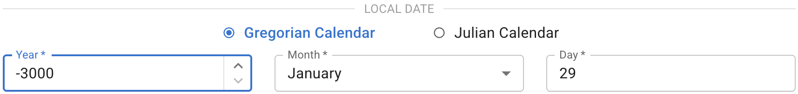
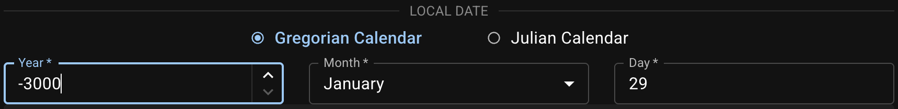
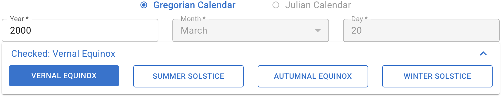
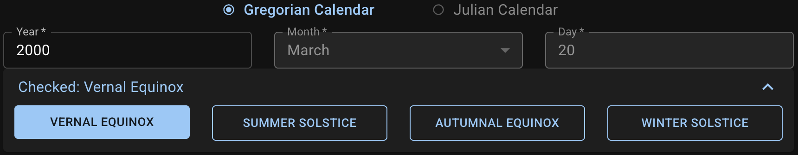

Specify the observer's **local date** by filling out each field or querying an **equinox/solstice** date as a quick entry.

## Enter a Date in the Gregorian or Julian Calendar

The valid date range is from **February 23, 3001 BCE (Julian)** to **May 6, 3000 CE (Gregorian)**.
{ .img-light } { .img-dark }

The `Year` input value follows the [astronomical year numbering][]. `0` means **1 BCE**.

::: callout info "Calendar Conversion"
Dates in both calendars will be displayed after generating the diagram. Date conversion is not performed when toggling from one calendar to another but will be done during the star path calculation.
:::

::: callout tip "Chinese Calendar"
The date in the [Chinese calendar][CC-python] will be [displayed as a tooltip][CC tooltip] if available.

[CC-python]: https://github.com/ytliu0/ChineseCalendar-python
[CC tooltip]: ./guides/results

:::

[astronomical year numbering]: https://en.wikipedia.org/wiki/Astronomical_year_numbering

## Look Up an Equinox/Solstice

When the `Year` is given and a location is specified, click one of the four **equinox/solstice** buttons on the `Quick Entry` panel to auto-fill the date in the **Standard Time** of this location.
{ .img-light } { .img-dark }

::: callout info
For equinox/solstice queries, the dates are always in **Gregorian** calendar.
:::

In the southern hemisphere, the _vernal equinox_ is the [_March equinox_][March equinox], the _summer solstice_ is the [_June solstice_][June solstice], etc.

[March equinox]: https://en.wikipedia.org/wiki/March_equinox
[June solstice]: https://en.wikipedia.org/wiki/June_solstice
