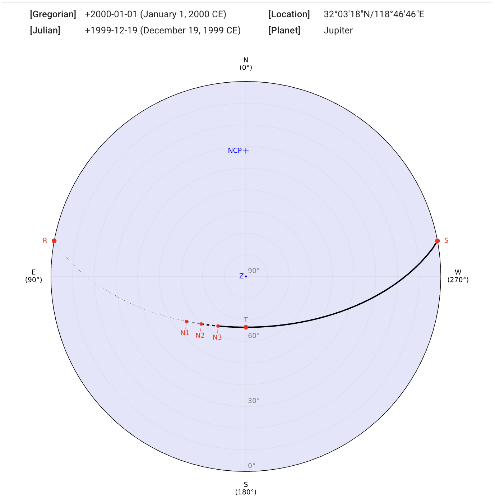
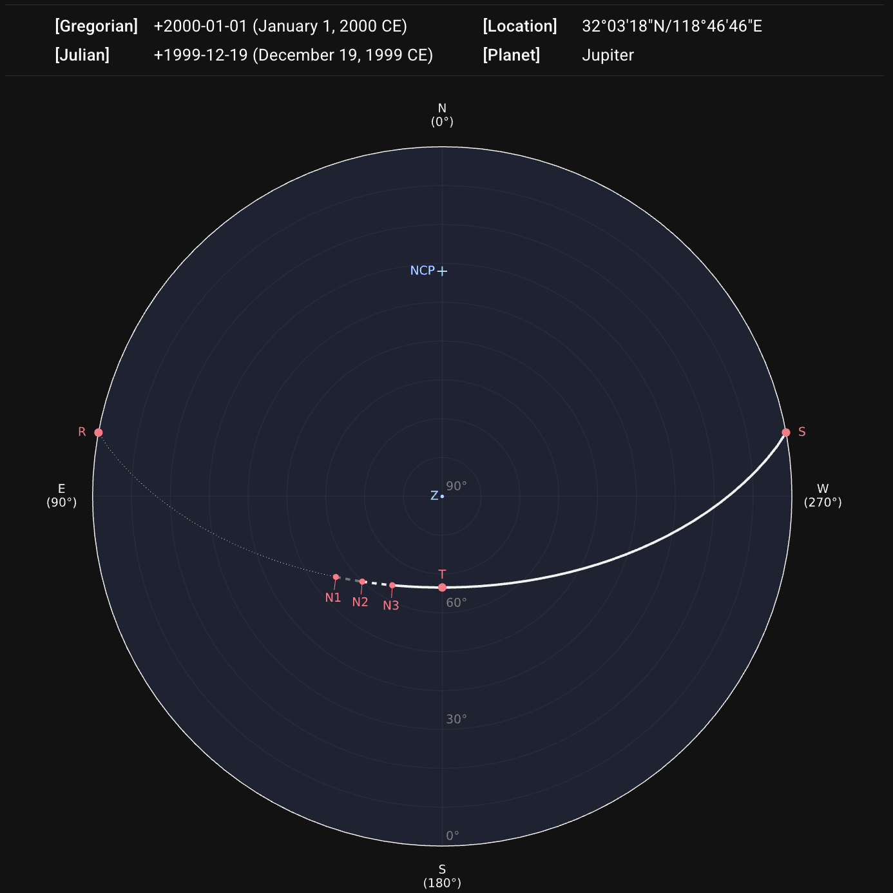
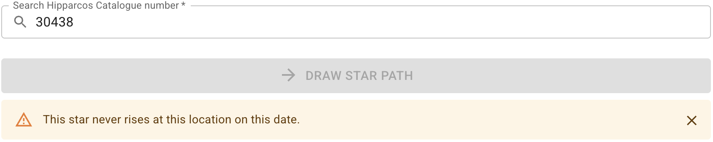
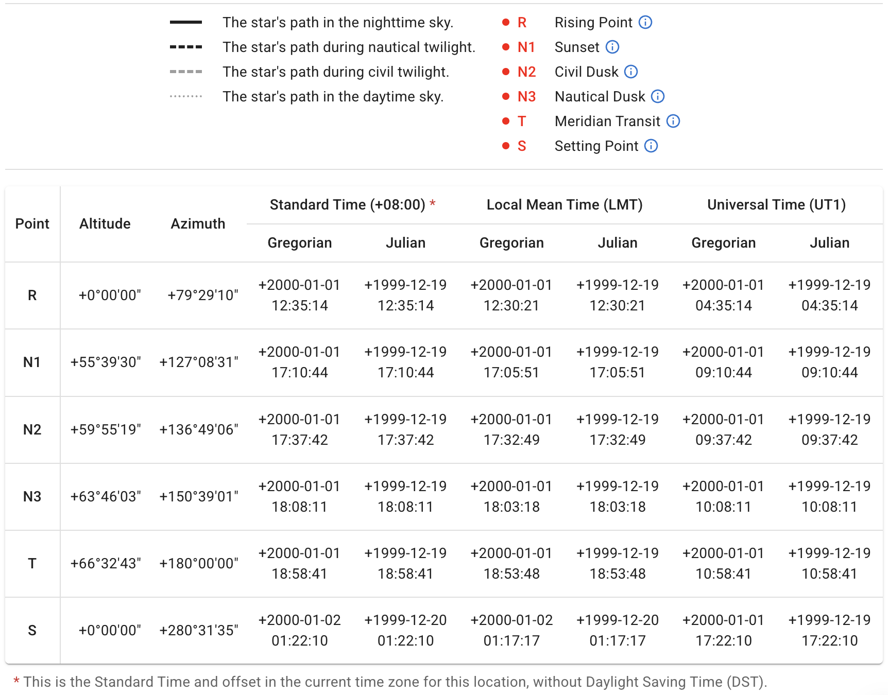
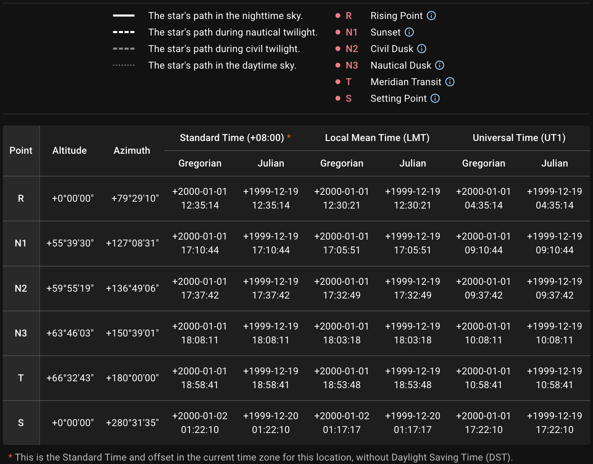

## Path of Apparent Motion Projected onto Horizontal Coordinate System

After sending the request by clicking the `DRAW STAR PATH` button, our server will return a diagram and relevant data. The information about the querying location, date, and target will be displayed above the diagram.

The diagram is in [horizontal coordinate system][]. The [north and south celestial poles][] (labeled `NCP` and `SCP`) and the [zenith][] (labeled `Z`) are shown if they are within the coordinate range.
{ .img-light } { .img-dark }

::: callout tip "Date in Chinese Calendar"
If the querying date is able to be converted to the Chinese calendar, the converted date is placed as a tooltip. Hovering on the dates (or tapping on mobile devices) shows it.
{ .img-light } { .img-dark }
:::

::: callout info "If a Star Never Rises"
If the querying star never rises on the given date observed from the certain location, it warns:
{ .img-light } { .img-dark }
:::

[horizontal coordinate system]: https://en.wikipedia.org/wiki/Horizontal_coordinate_system
[north and south celestial poles]: https://en.wikipedia.org/wiki/Celestial_pole
[zenith]: https://en.wikipedia.org/wiki/Zenith

## Legend and Data Table

The path segments are depicted in different styles according to the **twilight stages**. The star positions at **rising**, **setting**, and **meridian-transit** are marked as points on the diagram as well. A legend and a table containing coordinates and times of these points are appended to show more details.
{ .img-light } { .img-dark }

::: callout tip "Point Details"
Hovering on the **ⓘ** icon (or tapping on mobile devices) shows an explanation of this point label.
{ .img-light } { .img-dark }
:::

## Download

The diagram can be exported as `SVG`, `PNG`, or `PDF`. The table can be exported as `CSV`, `JSON`, or `XLSX`.

::: card "Metadata"
The information about this query will be embedded as the metadata in `SVG`:

```xml
<metadata>
  <title>sp_1777589177.716</title>
  <desc>Date (Gregorian): +2000-01-01</desc>
  <desc>Location (lat/lng): 32.055/118.779</desc>
  <desc>Celestial Object: Jupiter</desc>
</metadata>
```

or as the `Description` of the document properties in `PDF`:

```text
Location (lat/lng): 32.055/118.779,
Date (Gregorian): +2000-01-01,
Celestial Object: Jupiter
```

:::
