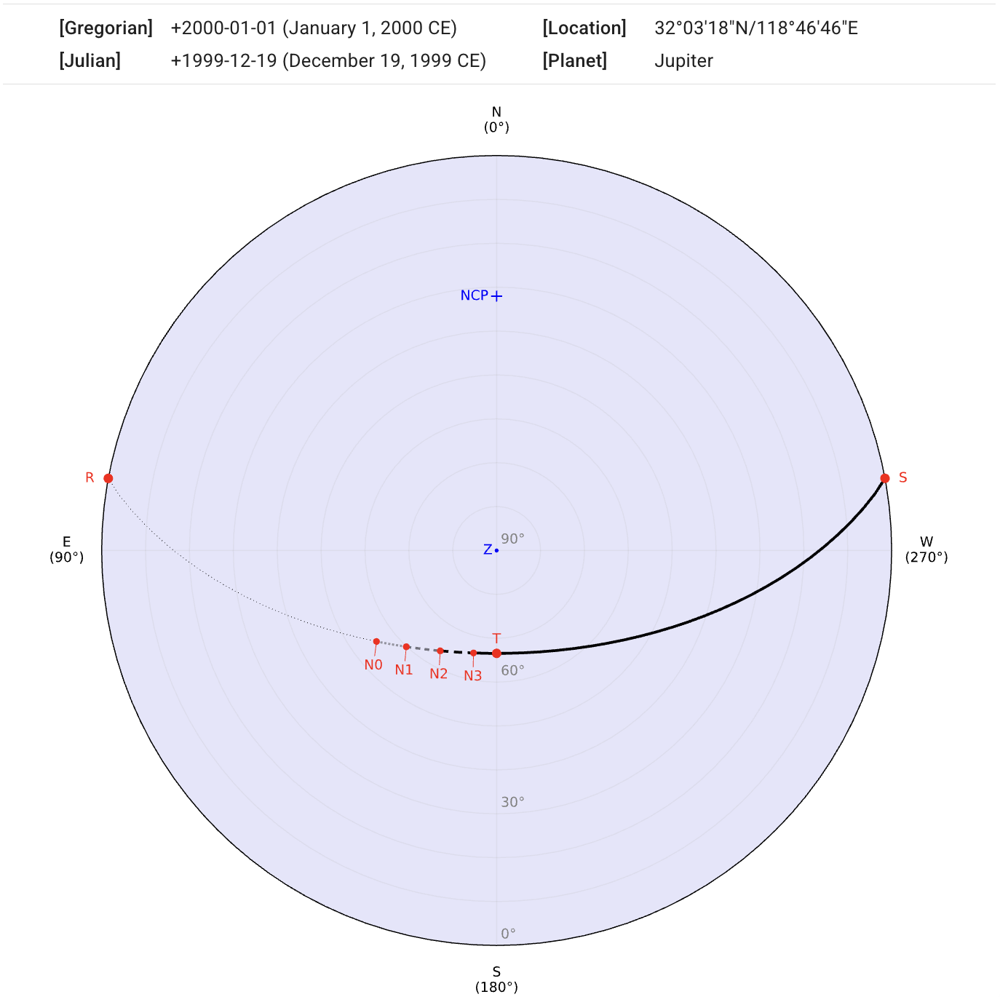
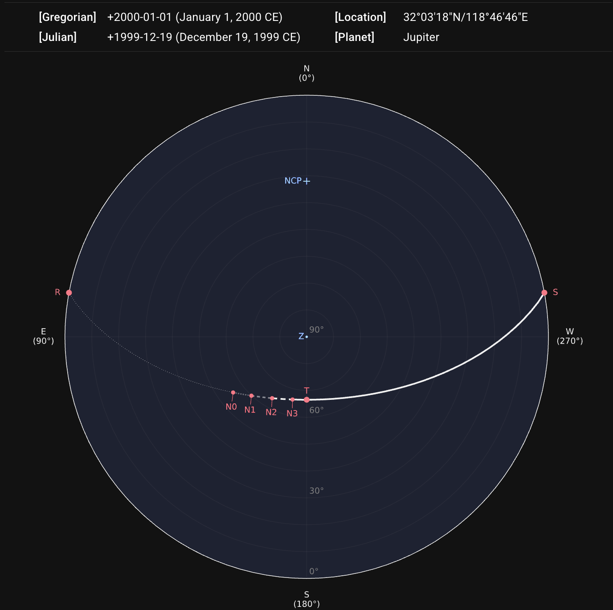
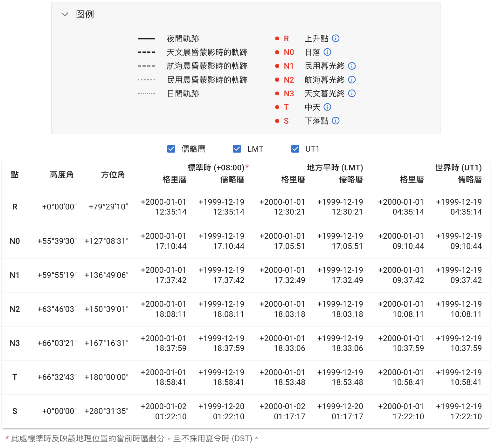
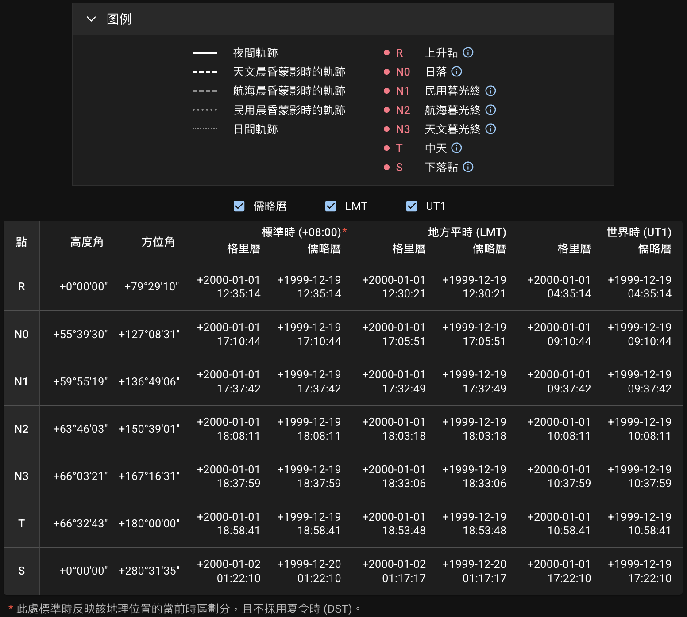
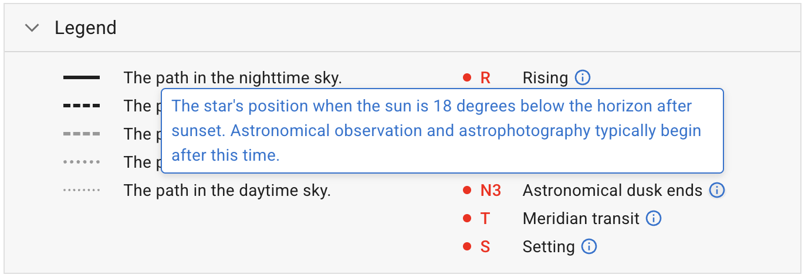
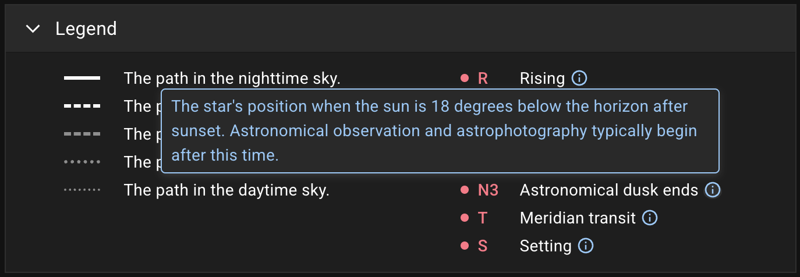

## Diagram in the Horizontal Coordinate System {#diagram}

After sending the request by clicking the `DRAW STAR PATH` button, our server will return a diagram and a data table. The information about the querying location, date, and target will be displayed above the diagram.

::: callout info "About the Speed"
As this project is open-source and non-commercial, our server is hosted under a free plan. Therefore, the connection and processing times may occasionally be longer than expected. However, results are typically available within a few seconds at most.
:::

The path of the star's apparent motion is projected onto a [horizontal coordinate system][], where angles **altitude** (alt.) and **azimuth** (az.) are the two independent coordinates. The outermost outline on the diagram represents the horizon observer's local horizon. The [north and south celestial poles][] (labeled `NCP` and `SCP`) and the [zenith][] (labeled `Z`) are shown if they are within the coordinate range.
{ .img-light .size-large } { .img-dark .size-large }

::: callout info "If a Star Never Rises"
If the querying star never rises on the given date observed from the certain location, it warns:
{ .img-light } { .img-dark }
:::

### Date in the Chinese Calendar {#chinese-calendar-tooltip}

If the querying date is able to be converted to the Chinese calendar, the converted date is placed as a tooltip. Hovering on the Gregorian or Julian date (or tapping on mobile devices) shows it.
{ .img-light } { .img-dark }

[horizontal coordinate system]: https://en.wikipedia.org/wiki/Horizontal_coordinate_system
[north and south celestial poles]: https://en.wikipedia.org/wiki/Celestial_pole
[zenith]: https://en.wikipedia.org/wiki/Zenith

## Legend and Table of Coordinates and Times {#legend-and-table}

The path segments are depicted in different styles according to the **twilight types**. The star positions at **rising**, **setting**, and **meridian-transit** are marked as points on the diagram as well. A legend and a table containing coordinates and times of these points are appended to show more details.
{ .img-light } { .img-dark }

::: callout tip "Point Details"
Hovering on the **ⓘ** icon (or tapping on mobile devices) shows an explanation of this point label. See [Conventions][] section for reference.
{ .img-light } { .img-dark }

[Conventions]: ../conventions/

:::

::: callout info "Local Mean Time"
The [Local Mean Time (LMT)][LMT] in the table is derived directly from the observer's latitude and longitude.

About the **Standard Time**, see [Time Zone] section for details.

[LMT]: https://en.wikipedia.org/wiki/Local_mean_time
[Time Zone]: ../conventions/#time-zone

:::

::: callout info "Atmospheric Refraction"
The [atmospheric refraction][] has been taken into account in the position calculation. See [Altitude Calculation][] for more details.

[atmospheric refraction]: https://en.wikipedia.org/wiki/Atmospheric_refraction
[Altitude Calculation]: ../conventions/#altitude-calculation

:::

## Export {#export}

The diagram can be exported as `SVG`, `PNG`, or `PDF`. The table can be exported as `CSV`, `JSON`, or `XLSX`. The number in the filename, e.g., `1777589177.716`, is a Unix timestamp representing the creation time of the results and is the same across both the exported image and table.

::: card "Metadata"
The information about this query will be embedded as the **metadata** in `SVG`:

```xml
<metadata>
  <title>sp_1777589177.716</title>
  <desc>Date (Gregorian): +2000-01-01</desc>
  <desc>Location (lat/lng): 32.055/118.779</desc>
  <desc>Celestial Object: Jupiter</desc>
</metadata>
```

or as the `Description` of the document properties in `PDF`:

```text
Location (lat/lng): 32.055/118.779,
Date (Gregorian): +2000-01-01,
Celestial Object: Jupiter
```

:::
