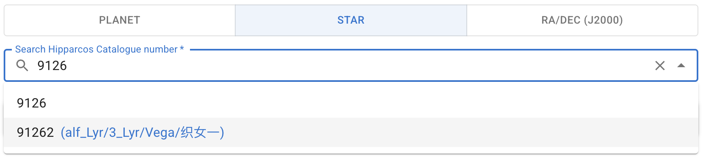
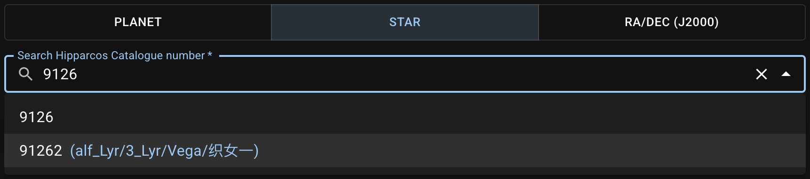
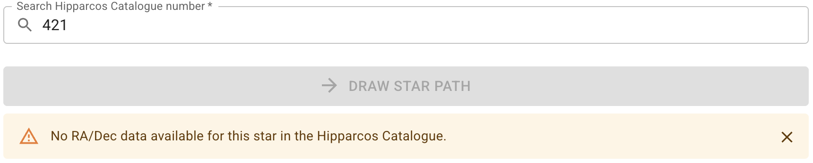
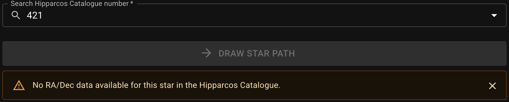
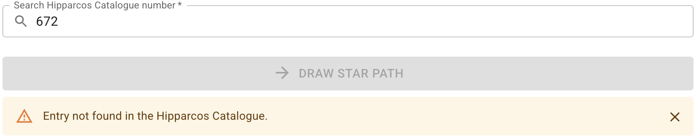
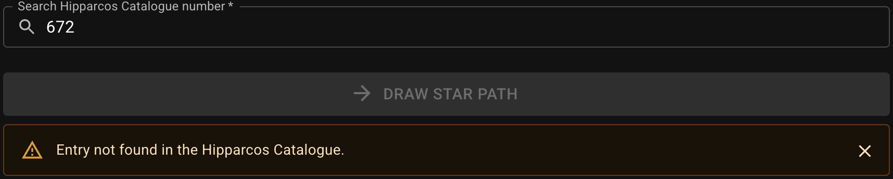
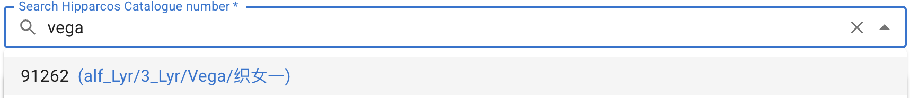
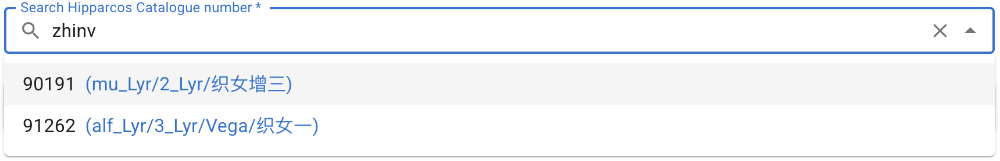
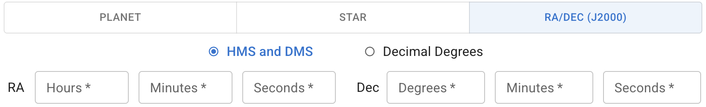

Specify a target using either of the following three methods.

## Select a Planet {#select-planet}

{ .img-light } { .img-dark }

## Specify a Hipparcos Catalogue Number (HIP) {#search-hip}

### Search HIP by Number {#search-hip-by-number}

Enter a number then select one suggestion from the drop-down list.
{ .img-light } { .img-dark }

As shown above, the HIP and any available [Bayer designation][], [proper name][], or Chinese names of the star are shown side by side for your reference.

::: callout info "Available HIP Range"
The available HIP filtered from the [HIP data source][HIP data] ranges from `1` to `118322`. Although there are objects with greater HIP in the original catalogue, they lack the required information and those entries are barely needed in most cases, hence excluded in this app.

If a HIP is invalid even within the range, a notification will appear after submitting the request:
{ .img-light } { .img-dark } { .img-light } { .img-dark }

[Bayer designation]: https://en.wikipedia.org/wiki/Bayer_designation
[proper name]: https://en.wikipedia.org/wiki/Stellar_designations_and_names
[HIP data]: https://cdsarc.cds.unistra.fr/ftp/cats/I/239

:::

### Search HIP by Proper Name or Bayer Designation {#search-hip-by-name}

Enter a **proper name** or **Bayer designation** (case-insensitive), then select one suggestion from the drop-down list to get its HIP.
{ .img-light } { .img-dark }

::: callout info "Greek Romanization"
The format of Bayer designation used in this app is based on that in the original cross-identification tables (see [Resources][] for the data source).

```text
α → alf   β → bet   γ → gam   δ → del     ε → eps   ζ → zet
η → eta   θ → the   ι → iot   κ → kap     λ → lam   μ → mu
ν → nu    ξ → ksi   ο → omi   π → pi      ρ → rho   σ → sig
τ → tau   υ → ups   φ → phi   χ → chi/xi  ψ → psi   ω → ome
```

[Resources]: ../resources/#bayer-designation-and-proper-name

:::

### Search HIP by Chinese Name {#search-hip-by-chinese-name}

Enter a name in **Traditional/Simplified Chinese** or **Pinyin**, then select one suggestion from the drop-down list to get its HIP.
{ .img-light } { .img-dark }

::: callout tip "Typing Pinyin"
When searching a name by pinyin, avoid spaces between syllables. We also use this convention to display the pinyin in the results for a more compact appearance.

You can use either `v`, `yu`, or `u` for `ü`.
:::

::: callout info "Proper Motion Included"
[Proper motion][] is included in calculation if the target is specified by a Hipparcos Catalogue number.

[Proper motion]: https://en.wikipedia.org/wiki/Proper_motion

:::

## Specify RA/Dec {#enter-radec}

You can track a fixed point in the sky by giving the [International Celestial Reference System (ICRS)][ICRS] coordinates (J2000) [right ascension (RA)][RA] and [declination (Dec)][Dec].

Enter **RA** in **HMS** (Hour, Minute, and Second) format and **Dec** in **DMS** (Degree, Minute, and Second) format:
{ .img-light } { .img-dark }
or both in **decimal degrees**:
{ .img-light } { .img-dark }

::: callout info "No Proper Motion"
Proper motion is not considered if the target is specified by RA/Dec, because the values are the coordinates of a point, and there may not be any actual celestial bodies at this position.
:::

[ICRS]: https://science.nasa.gov/learn/basics-of-space-flight/chapter2-2/
[RA]: https://en.wikipedia.org/wiki/Right_ascension
[Dec]: https://en.wikipedia.org/wiki/Declination
