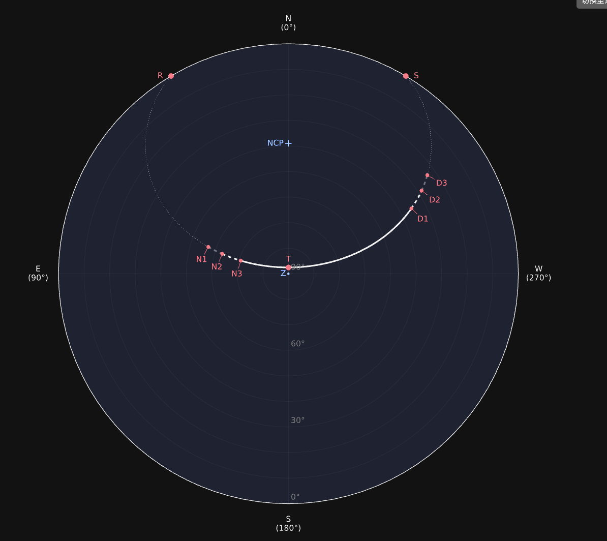
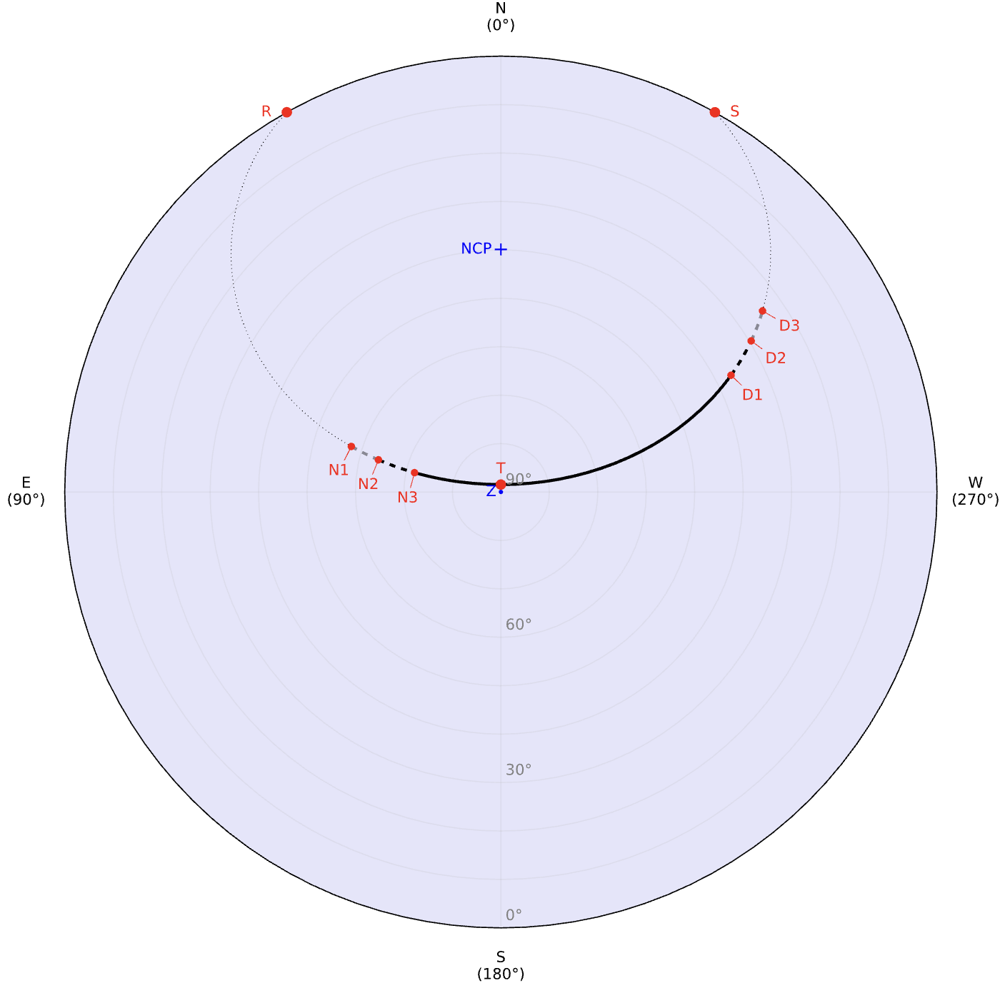

::: hero layout:split glow:false

# Star Path Viewer

An online astronomical application for tracking a star on a given date.

::: button "Guides" ./guides/location.md icon:telescope
::: button "GitHub" external:https://github.com/stardial-astro/star-path-viewer color:#333 icon:github

== side

:::

## :rocket: Quick Start {#quick-start}

[Star Path Viewer][] computes a planet or star's positions on the celestial sphere based on input. It generates a diagram with a curved path representing the [apparent motion][] projected onto the observer's local [horizontal coordinate system][]. A table of the rising/setting/transit/twilight times and star positions will also be appended.

**Step 1.** To make a request, please provide the [`LOCATION`][Location Input], [`LOCAL DATE`][Date Input], and [`CELESTIAL OBJECT`][Star Input].

**Step 2.** Click the [`DRAW STAR PATH`][Draw] button to submit the request. The results will be displayed below this button.

::: callout tip "There are other things you can do using this app as a handy gizmo"
:bulb: What is the **latitude/longitude** of this location? → [Search address][Search Address]
:bulb: When are the **equinoxes/solstices** of this year? → [Equinoxes/solstices][Quick Entry]
:bulb: What is the **name / Hipparcos Catalogue number** of this star? → [Search name/HIP][HIP]
:bulb: What is the **Chinese name** of this star? → [Search Chinese name][Chinese name]
:bulb: When will it get dark enough to observe the **aurora borealis** / **meteor shower** tonight? → [Check sunset and twilight times][Anno]
:bulb: How should I schedule my **astrophotography**? → [Check twilight times][Anno]

[Search Address]: ./guides/location/#search-address
[Quick Entry]: ./guides/date/#look-up-season
[HIP]: ./guides/star/#search-hip-by-number
[Chinese name]: ./guides/star/#search-hip-by-chinese-name
[Anno]: ./guides/results/#legend-and-table

:::

[Star Path Viewer]: https://star-path-viewer.pages.dev/
[apparent motion]: https://en.wikipedia.org/wiki/Diurnal_motion
[horizontal coordinate system]: https://en.wikipedia.org/wiki/Horizontal_coordinate_system
[Location Input]: ./guides/location
[Date Input]: ./guides/date
[Star Input]: ./guides/star
[Draw]: ./guides/results

## :sparkles: Highlights {#highlights}

::: grids
::: grid
::: card "Across the Ages" icon:pyramid
Covers a wide range of querying dates from **3001 BCE** to **3000 CE**.
:::
:::
::: grid
::: card "Authoritative Sources " icon:atom
Powered by **authoritative data sources** and **scientific libraries**.
:::
:::
::: grid
::: card "Intuitive Visualization" icon:sparkles
Demonstrates a complete **star path** across the sky with explicit **annotations**.
:::
:::
::: grid
::: card "Twilight Transitions" icon:sunset
Marks a star's **rising/setting/transit** times and its positions during **twilights**.
:::
:::
::: grid
::: card "Multiple Calendars" icon:calendars
Supports **Gregorian** and **Julian** calendars. Displays available **Chinese calender**.
:::
:::
::: grid
::: card "Equinoxes and Solstices" icon:zodiac-aries
Offers queries for **equinoxes** and **solstices** given a year and a location.
:::
:::
:::
