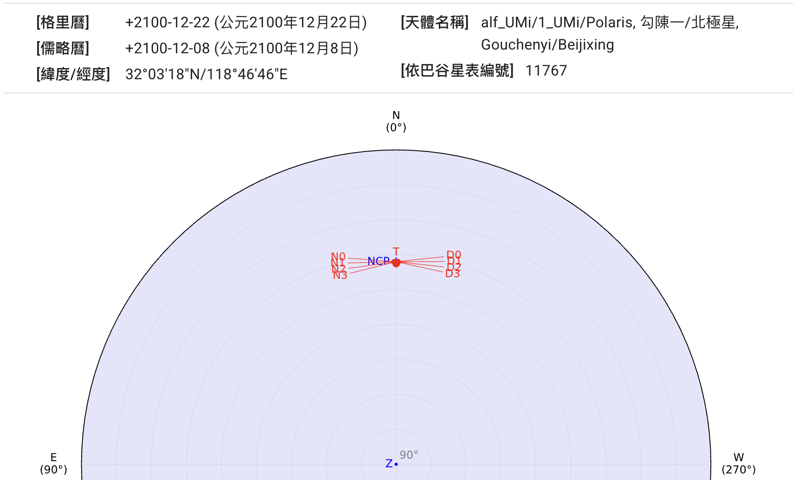
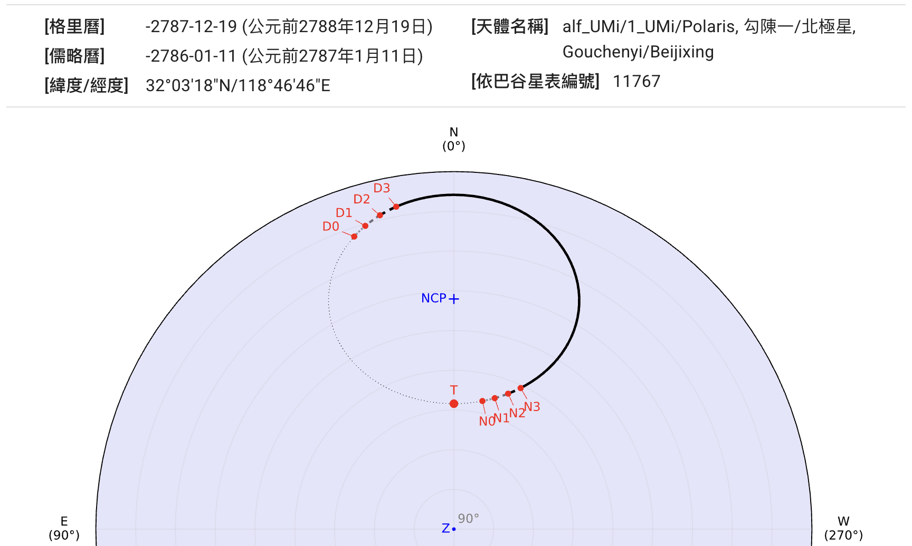
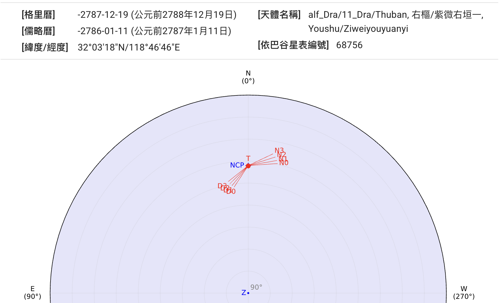

## 北極星

::: collapsible "公元2100年的勾陳一"

勾陳一（小熊座α）是現在的北極星。
{ .img-light } { .img-dark }
:::

::: collapsible "公元前2788年的勾陳一"

勾陳一（小熊座α）不是當時的北極星。
{ .img-light } { .img-dark }
:::

::: collapsible "公元前2788年的右樞"

右樞（天龍座α）為當時的北極星。
{ .img-light } { .img-dark }
:::
