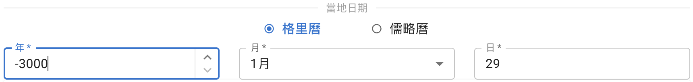
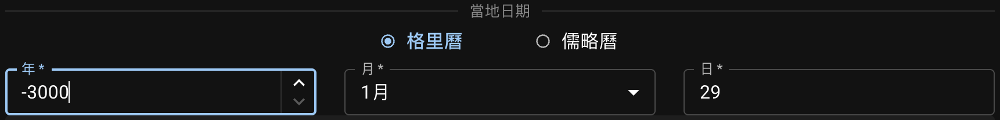
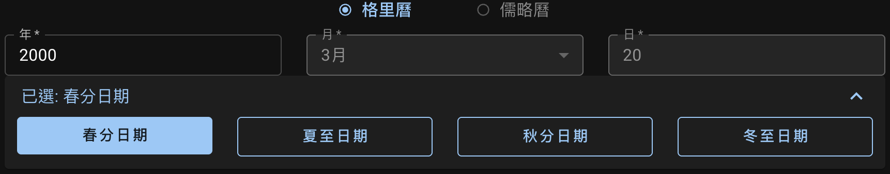

填寫觀測者當地的日期，或使用**二分二至**按鈕快速輸入相應日期。

## 輸入格里曆或儒略曆日期

可查詢的日期範圍為：**公元前3001年2月23日（儒略曆）**至**公元3000年5月6日（格里曆）**。
{ .img-light } { .img-dark }

`年`的輸入值根據 [天文計年法][astronomical year numbering]，`0` 表示**公元前1年**。

::: callout info "日曆轉換"
格里曆和儒略曆的日期會在生成圖像時同時返回。日期不會在切換這兩種歷時轉換，而是在計算軌跡的同時進行轉換。
:::

::: callout tip "農曆"
如存在相應的[農曆][CC-python]日期，將[以提示的形式顯示在結果中][CC].

[CC-python]: https://github.com/ytliu0/ChineseCalendar-python/blob/master/README_simp.md
[CC]: ./results

:::

[astronomical year numbering]: https://zh.wikipedia.org/wiki/%E5%A4%A9%E6%96%87%E8%A8%88%E5%B9%B4

## 查詢二分二至日期

當`年`已給定且已選定了地點時，點擊`快捷輸入`面板上其中一個**二分二至**按鈕，可自動填入相應日期。該日期以當地的**標準時間**顯示。
{ .img-light } { .img-dark }

::: callout info
二分二至日期時始終顯示為**格里曆**。
:::

在南半球，春分點即[三月分點][March equinox]，夏至點即[六月至點][June solstice]，以此類推。

[March equinox]: https://zh.wikipedia.org/wiki/%E5%8C%97%E5%88%86%E9%BB%9E
[June solstice]: https://zh.wikipedia.org/wiki/%E5%85%AD%E6%9C%88%E8%87%B3%E9%BB%9E
