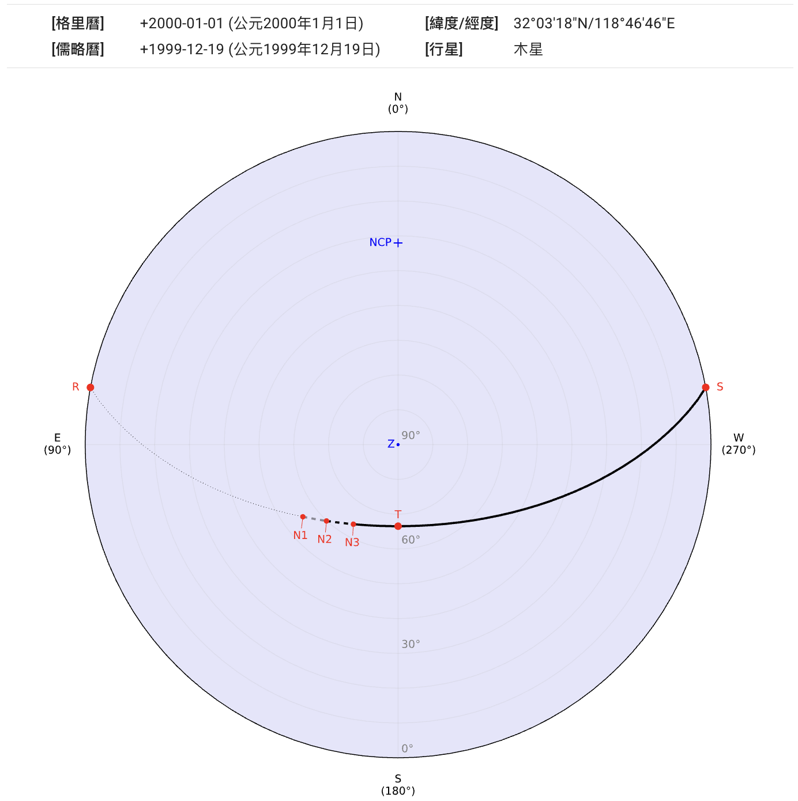
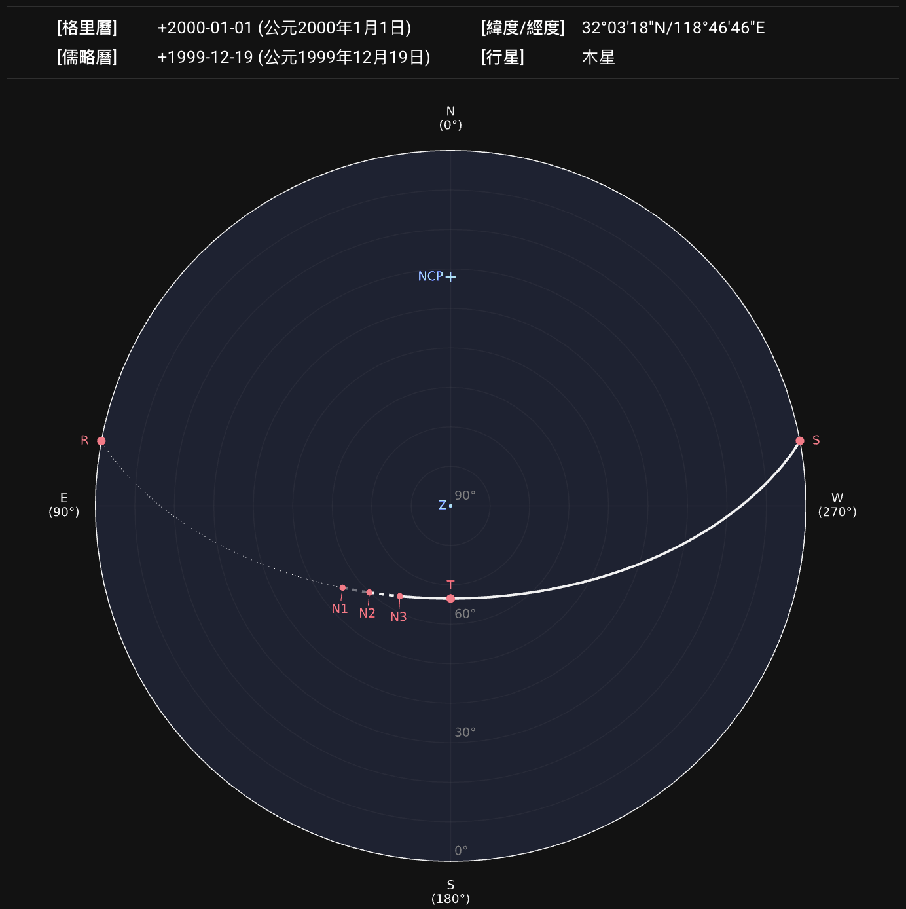
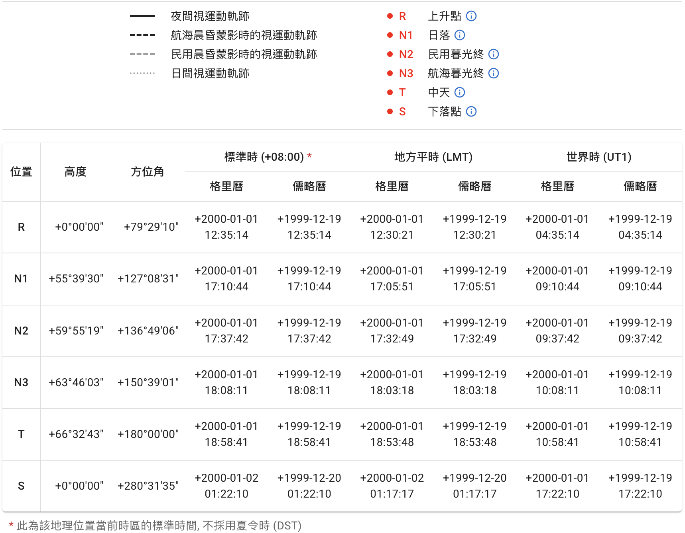

## 視運動軌跡地平座標投影圖

點擊`繪製星軌`按鈕發送請求後，服務器會以圖片和表格形式返回結果。查詢的地點、日期、天體等信息將顯示在圖像上方。

圖像採用[地平座標系][horizontal coordinate system]。[南北天極][north and south celestial poles]、[天頂][zenith]如果在座標範圍內，將分別標記為 `NCP`、`SCP` 和 `Z`。
{ .img-light } { .img-dark }

::: callout tip "農曆日期"
如果該查詢日期可被轉換為農曆日期，將顯示為浮動提示。鼠標懸浮在顯示的日期上（在移動端則輕觸）即可看到提示。
{ .img-light } { .img-dark }
:::

::: callout info "如果天體未升起"
如果對所選地點和日期，查詢的天體未曾升起，將顯示提示：
{ .img-light } { .img-dark }
:::

[horizontal coordinate system]: https://zh.wikipedia.org/wiki/%E5%9C%B0%E5%B9%B3%E5%9D%90%E6%A8%99%E7%B3%BB
[north and south celestial poles]: https://zh.wikipedia.org/wiki/%E5%A4%A9%E6%A5%B5
[zenith]: https://zh.wikipedia.org/wiki/%E5%A4%A9%E9%A0%82

## 圖例和數據表格

圖中的星軌根據不同晨昏階段使用不同線型繪製以便區分。所選天體在升落和中天的位置也標記在圖中。圖片下方附帶了圖例和數據表格供參考。表格中包含了這些標記位置的相應座標和時刻。
{ .img-light } { .img-dark }

::: callout tip "標記點説明"
鼠標懸浮在 **ⓘ** 符號上（在移動端則輕觸）可打開相應標記點的解釋。
{ .img-light } { .img-dark }
:::

## 下載

生成的圖像可導出為 `SVG`、`PNG` 或 `PDF` 格式。表格可導出為 `CSV`、`JSON` 或 `XLSX` 格式。

::: callout info "元數據"
查詢信息將以元數據的形式嵌入 `SVG` 文件：

```xml
<metadata>
  <title>sp_1777589177.716</title>
  <desc>Date (Gregorian): +2000-01-01</desc>
  <desc>Location (lat/lng): 32.055/118.779</desc>
  <desc>Celestial Object: Jupiter</desc>
</metadata>
```

或嵌入到 `PDF` 文檔屬性的 `描述` 部分：

```text
Location (lat/lng): 32.055/118.779,
Date (Gregorian): +2000-01-01,
Celestial Object: Jupiter
```

:::
