選用以下方法指定天體。

## 選擇行星 {#select-planet}

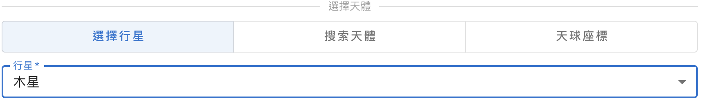{ .img-light } 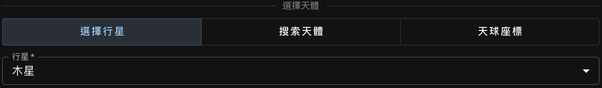{ .img-dark }

## 指定依巴谷星表編號 (HIP) {#search-hip}

### 檢索編號 {#search-hip-by-number}

輸入數字以檢索編號，然後從下拉列表中選擇一個條目。
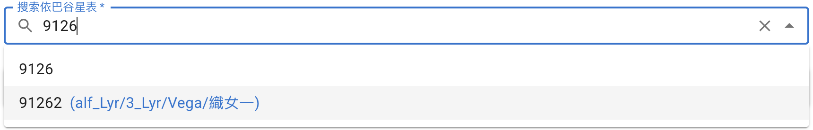{ .img-light } 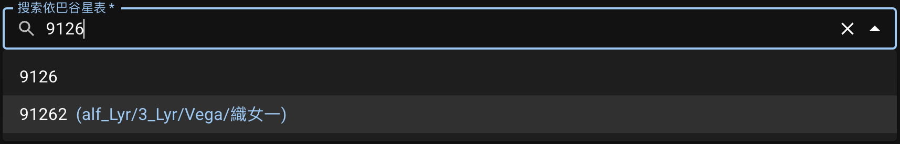{ .img-dark }

如上所示，如果候選條目的數據中包含任何[拜耳星名][Bayer designation]、[專有名稱][proper name]或中文名，將同時顯示在編號旁以供參考。

::: callout info "可檢索的依巴谷星表編號範圍"
我們從[依巴谷星表數據源][HIP data]中篩選的可供檢索的編號範圍為 `1` 至 `118322`。儘管原表中存在編號更大的天體，但它們的信息不完整且幾乎不會被用到，因此我們排除了這些條目。

如果某天體的編號在可檢索範圍內卻缺乏所需信息，將會給出相應提醒：
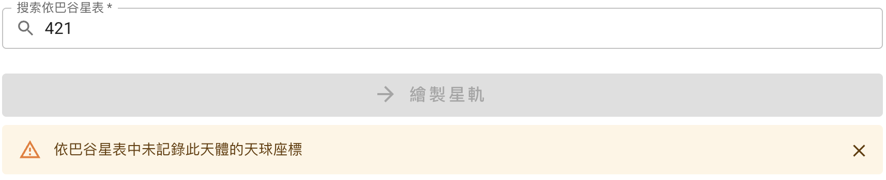{ .img-light } 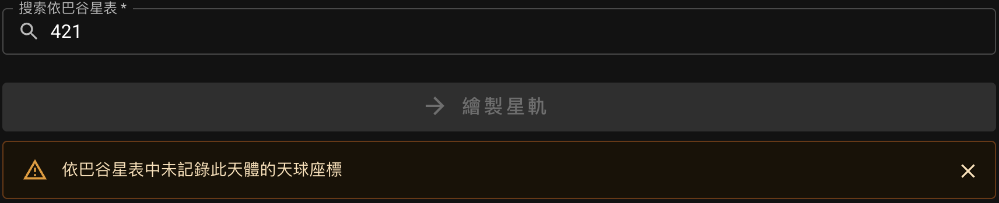{ .img-dark } 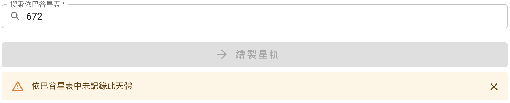{ .img-light } 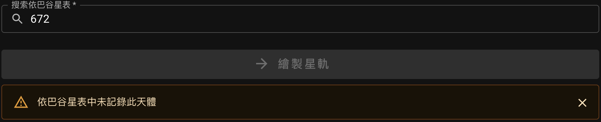{ .img-dark }

[Bayer designation]: https://zh.wikipedia.org/wiki/%E6%8B%9C%E8%80%B3%E5%91%BD%E5%90%8D%E6%B3%95
[proper name]: https://zh.wikipedia.org/wiki/%E6%81%86%E6%98%9F%E5%91%BD%E5%90%8D
[HIP data]: https://cdsarc.cds.unistra.fr/ftp/cats/I/239

:::

### 通過專有名稱或拜耳星名檢索編號 {#search-hip-by-name}

輸入**專有名稱**或**拜耳星名**（不區分大小寫），然後從下拉列表中選擇一個條目以獲取編號。
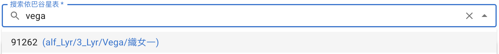{ .img-light } 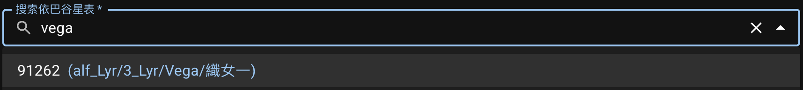{ .img-dark }

::: callout info "希臘字母與拉丁縮寫對照表"
本應用中拜耳星名的格式參考了數據源中的格式（數據源見[引用資源][Resources]）。

```text
α → alf   β → bet   γ → gam   δ → del     ε → eps   ζ → zet
η → eta   θ → the   ι → iot   κ → kap     λ → lam   μ → mu
ν → nu    ξ → ksi   ο → omi   π → pi      ρ → rho   σ → sig
τ → tau   υ → ups   φ → phi   χ → chi/xi  ψ → psi   ω → ome
```

[Resources]: ../resources/#bayer-designation-and-proper-name

:::

### 通過中文星名檢索編號 {#search-hip-by-chinese-name}

輸入**簡體中文**、**繁體中文**或**拼音**，然後從下拉列表中選擇一個條目以獲取編號。
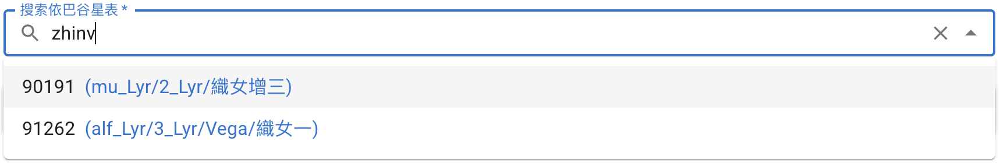{ .img-light } 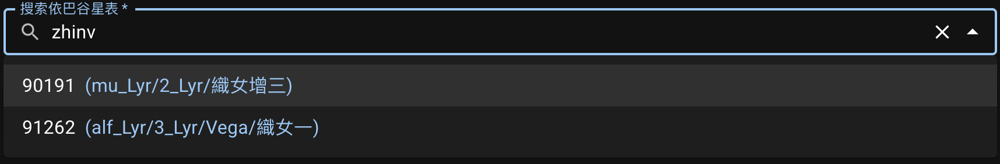{ .img-dark }

::: callout tip "拼音輸入"
使用拼音進行輸入時，字之間不含空格。為了讓顯示更緊湊，結果中顯示的拼音也不含空格。

拼寫時 `ü` 可用 `v`、`yu` 或 `u` 表示。
:::

::: callout info "已含自行"
使用依巴谷星表指定天體時，星軌計算中考慮了[自行][Proper motion]。

[Proper motion]: https://zh.wikipedia.org/wiki/%E8%87%AA%E8%A1%8C

:::

## 指定天球座標 {#enter-radec}

可通過輸入[國際天球參考系（ICRS）][ICRS]（J2000）的[赤經][RA]和[赤緯][Dec]座標來跟蹤天球上一個固定的點。

輸入格式可選擇**赤經**用**時·分·秒（HMS）**、**赤緯**用**度·分·秒（DMS）**：
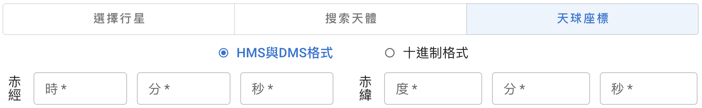{ .img-light } 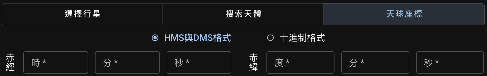{ .img-dark }
或都使用**十進制小數**：
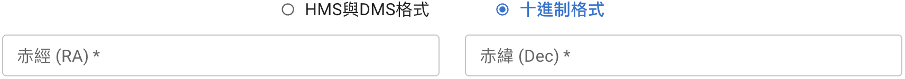{ .img-light } 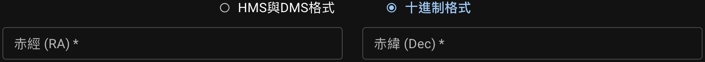{ .img-dark }

::: callout info "無自行"
使用赤經赤緯指定觀測目標時，星軌計算中不考慮自行，因為該座標點可能不對應任何天體。
:::

[ICRS]: https://science.nasa.gov/learn/basics-of-space-flight/chapter2-2/
[RA]: https://zh.wikipedia.org/wiki/%E8%B5%A4%E7%BB%8F
[Dec]: https://zh.wikipedia.org/wiki/%E8%B5%A4%E7%BA%AC
