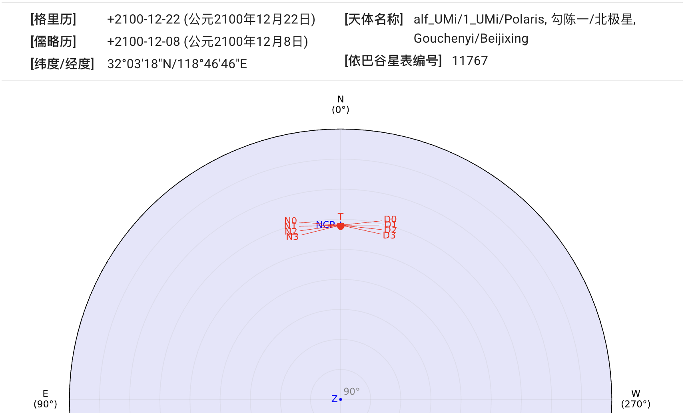
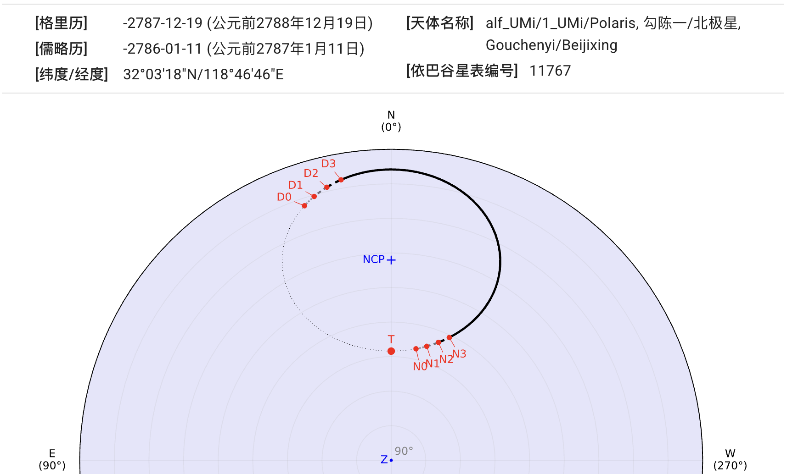
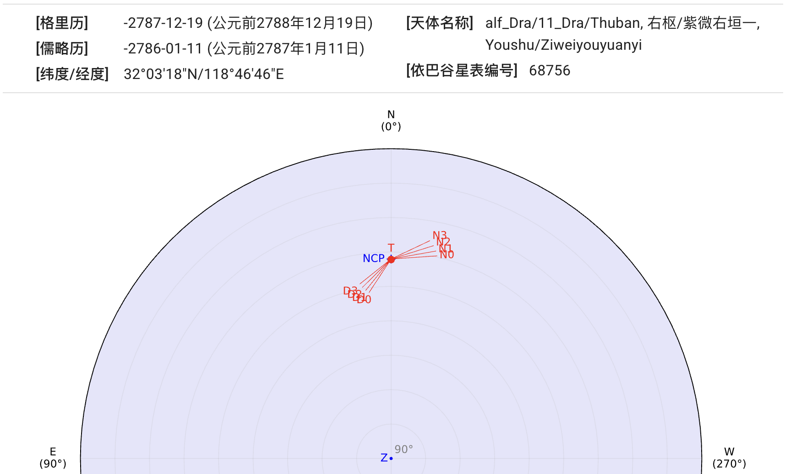

## 北极星

::: collapsible "公元2100年的勾陈一"

勾陈一（小熊座α）是现在的北极星。
{ .img-light } { .img-dark }
:::

::: collapsible "公元前2788年的勾陈一"

勾陈一（小熊座α）不是当时的北极星。
{ .img-light } { .img-dark }
:::

::: collapsible "公元前2788年的右枢"

右枢（天龙座α）为当时的北极星。
{ .img-light } { .img-dark }
:::
