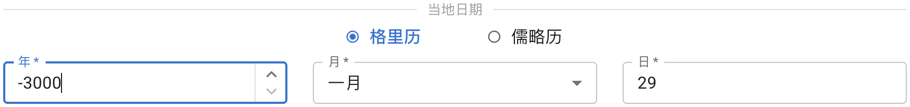
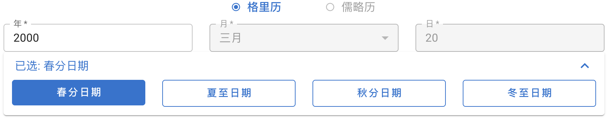
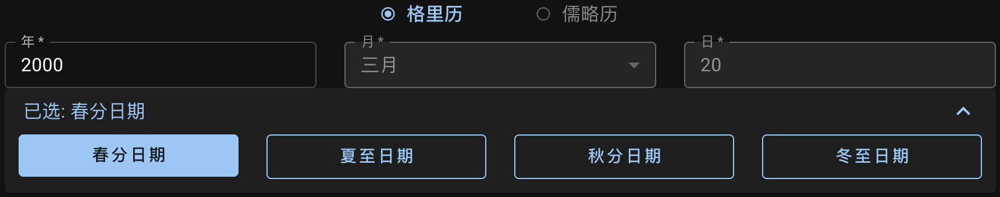

填写观测者当地的日期，或使用**二分二至**按钮快速输入相应日期。

## 输入格里历或儒略历日期 {#enter-date}

可查询的日期范围为：**公元前3001年2月23日（儒略历）**至**公元3000年5月6日（格里历）**。
{ .img-light } { .img-dark }

`年`的输入值采用 [天文计年法][astronomical year numbering]，`0` 表示**公元前1年**。

::: callout info "日历转换"
格里历和儒略历的日期会在生成图像时同时返回。日期不会在切换这两种日历时转换，而是在计算轨迹的同时进行转换。
:::

::: callout tip "农历"
如存在相应的[农历][CC-python]日期，将[以提示的形式显示在结果中][CC]。

[CC-python]: external:https://github.com/ytliu0/ChineseCalendar-python/blob/master/README_simp.md
[CC]: ./results/#chinese-calendar-tooltip

:::

[astronomical year numbering]: external:https://zh.wikipedia.org/wiki/%E5%A4%A9%E6%96%87%E8%A8%88%E5%B9%B4

## 查询二分二至日期 {#look-up-season}

当`年`已给定且已选定了地点时，点击`快捷输入`面板上其中一个**二分二至**按钮，可自动填入相应日期。该日期以当地的**标准时**显示。
{ .img-light } { .img-dark }

::: callout info
二分二至日期时始终显示为**格里历**。
:::

在南半球，春分点即[三月分点][March equinox]，夏至点即[六月至点][June solstice]，以此类推。

[March equinox]: external:https://zh.wikipedia.org/wiki/%E5%8C%97%E5%88%86%E9%BB%9E
[June solstice]: external:https://zh.wikipedia.org/wiki/%E5%85%AD%E6%9C%88%E8%87%B3%E9%BB%9E
