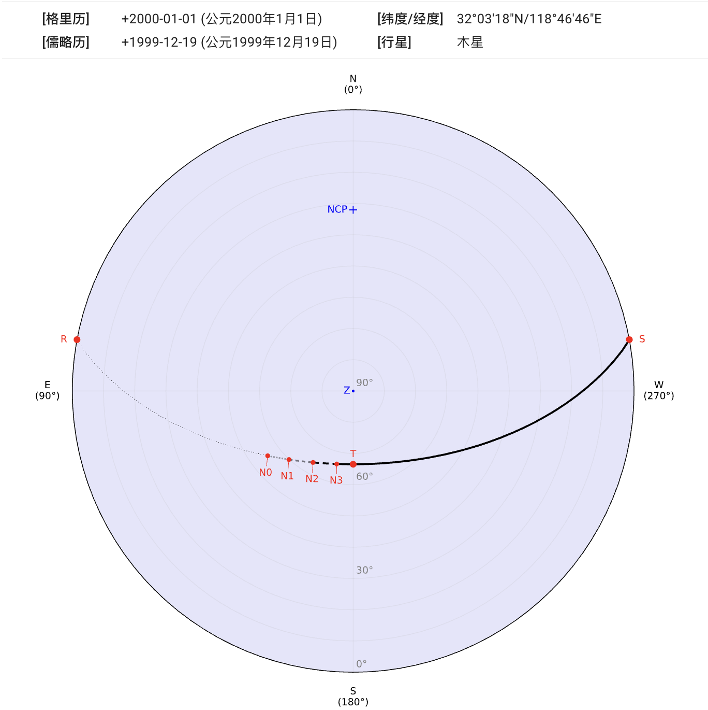
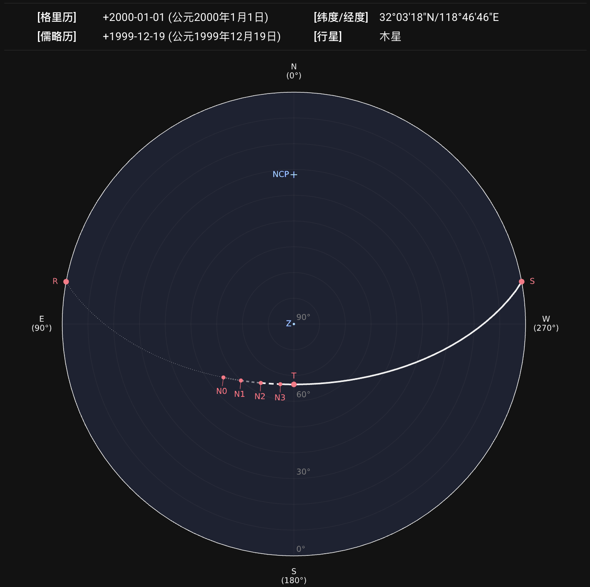
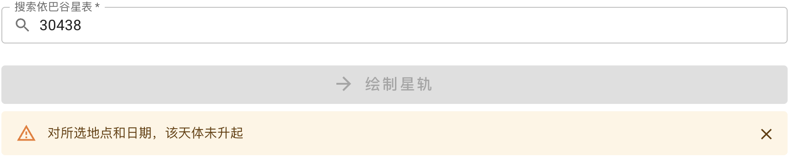
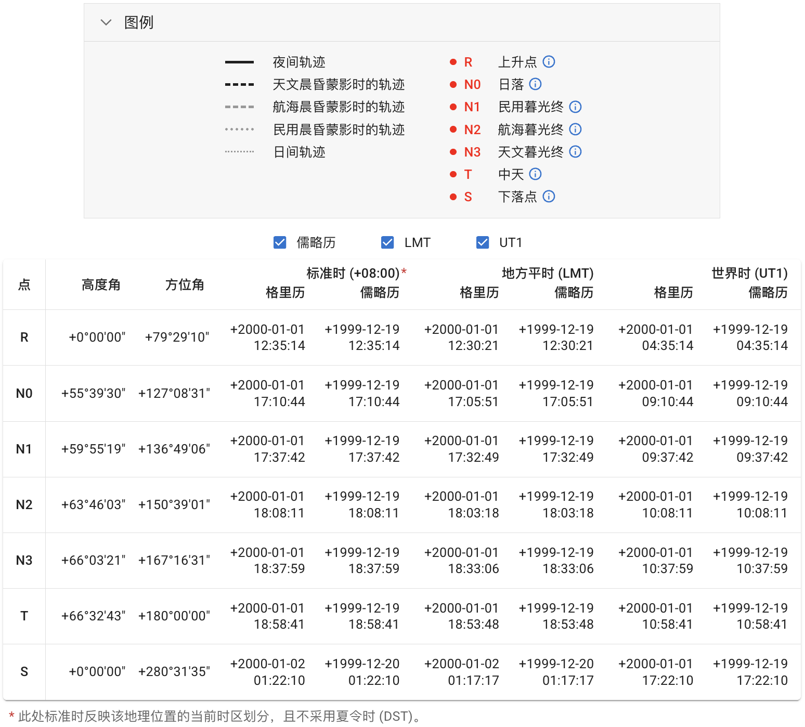
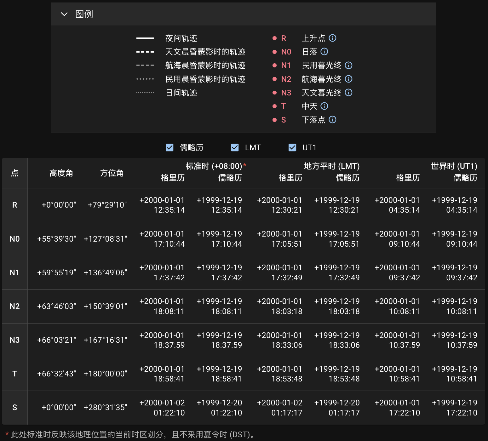
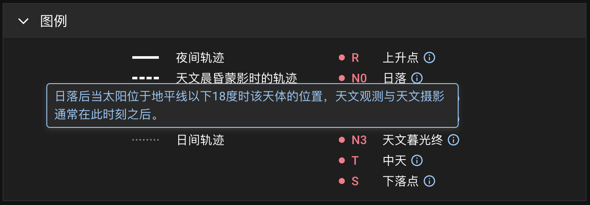

## 地平坐标投影图 {#diagram}

点击`绘制星轨`按钮发送请求后，服务器会以图片和表格形式返回结果。查询的地点、日期、天体等信息将同时显示在图像上方。

::: callout info "关于速度"
由于这是一个非商用的开源项目，我们服务器的搭载使用的是免费计划。因此，连接和运算时间偶尔会比预计长一些，但通常最多等待几秒钟即可获得结果。
:::

天体的视运动轨迹投影在[地平坐标系][horizontal coordinate system]上。该坐标系的两个独立坐标分别为**高度角**（地平纬度）和**方位角**（地平经度）。图中最外圈表示地平线。[南北天极][north and south celestial poles]和[天顶][zenith]如果在坐标范围内，将分别标记为 `NCP`、`SCP` 和 `Z`。
{ .img-light } { .img-dark }

::: callout info "如果天体未升起"
如果对所选地点和日期，查询的天体未曾升起，则显示提示：
{ .img-light } { .img-dark }
:::

### 农历日期 {#chinese-calendar-tooltip}

如果查询的日期可被转换为农历，该农历日期将显示为浮动提示。光标悬停在格里历或儒略历日期上（在移动端则轻触）即可看到提示。
{ .img-light } { .img-dark }

[horizontal coordinate system]: https://zh.wikipedia.org/wiki/%E5%9C%B0%E5%B9%B3%E5%9D%90%E6%A8%99%E7%B3%BB
[north and south celestial poles]: https://zh.wikipedia.org/wiki/%E5%A4%A9%E6%A5%B5
[zenith]: https://zh.wikipedia.org/wiki/%E5%A4%A9%E9%A0%82

## 图例与坐标时刻表 {#legend-and-table}

图中的星轨根据不同晨昏阶段使用不同线型绘制加以区分。所选天体在升落和中天的位置也标记在图中。图片下方附带了图例和数据表格供参考。表格中包含了这些标记点的相应坐标和时刻。
{ .img-light } { .img-dark }

::: callout tip "标记点说明"
光标悬停在 **ⓘ** 符号上（在移动端则轻触）可打开相应标记点的解释。参见[惯例约定][Conventions]部分。
{ .img-light } { .img-dark }

[Conventions]: ../conventions/

:::

::: callout info "地方平时"
表格中的[地方平时（LMT）][LMT]直接由观测地经纬度计算得出。

关于**标准时**，参见[时区][Time Zone]部分的说明。

[LMT]: https://zh.wikipedia.org/wiki/%E5%9C%B0%E6%96%B9%E5%B9%B3%E6%99%82
[Time Zone]: ../conventions/#time-zone

:::

::: callout info "大气折射（蒙气差）"
计算天体位置时考虑了[大气折射][atmospheric refraction]效应。更多细节参见[计算高度角][Altitude Calculation]部分。

[atmospheric refraction]: https://zh.wikipedia.org/wiki/%E5%A4%A7%E6%B0%A3%E6%8A%98%E5%B0%84
[Altitude Calculation]: ../conventions/#altitude-calculation

:::

## 导出结果 {#export}

生成的图像可导出为 `SVG`、`PNG` 或 `PDF` 格式。表格可导出为 `CSV`、`JSON` 或 `XLSX` 格式。文件名中的数字（例如`1777589177.716`）为生成结果时的 Unix 时间戳，并且在导出的图片和表格文件名中是一致的。

::: card "元数据"
查询信息将以**元数据**的形式嵌入 `SVG` 文件：

```xml
<metadata>
  <title>sp_1777589177.716</title>
  <desc>Date (Gregorian): +2000-01-01</desc>
  <desc>Location (lat/lng): 32.055/118.779</desc>
  <desc>Celestial Object: Jupiter</desc>
</metadata>
```

或嵌入 `PDF` 文档属性的 `描述` 部分：

```text
Location (lat/lng): 32.055/118.779,
Date (Gregorian): +2000-01-01,
Celestial Object: Jupiter
```

:::
