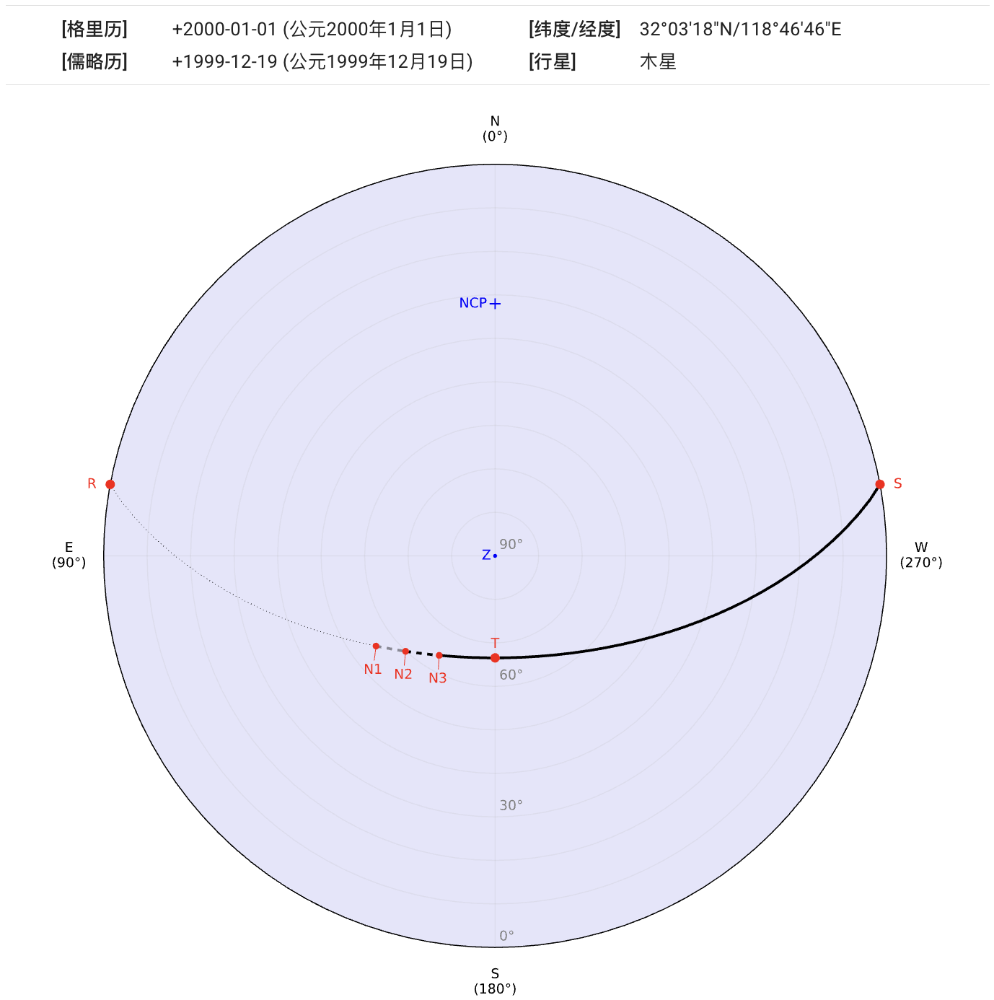
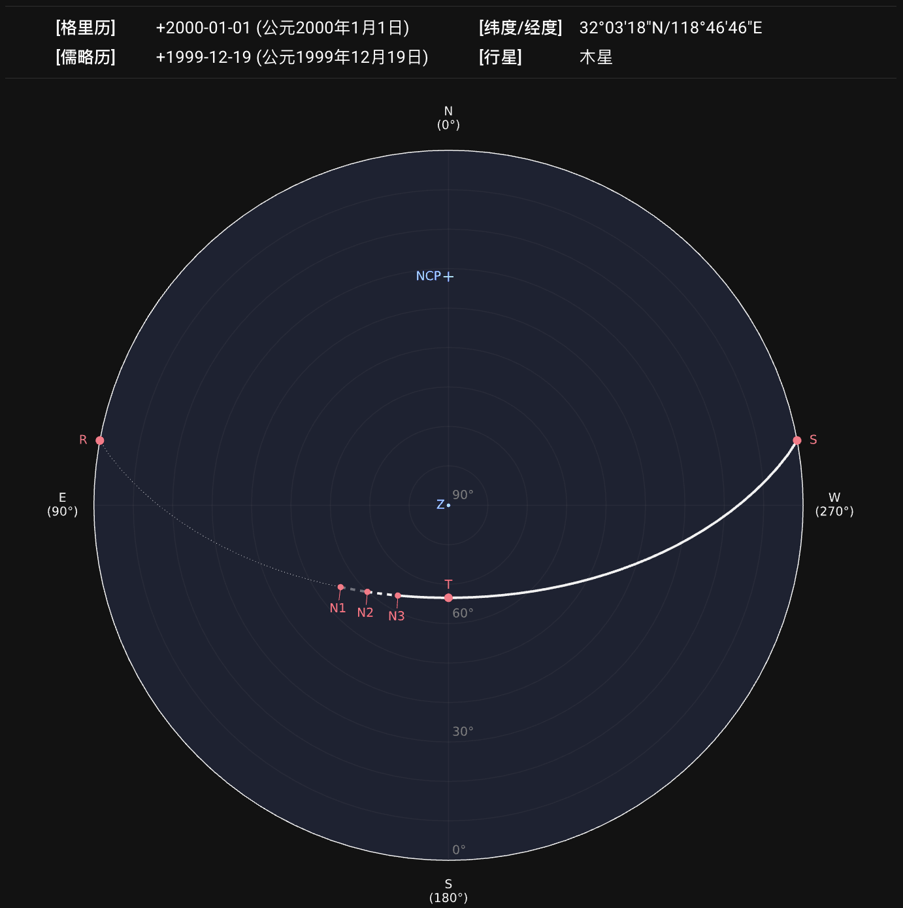
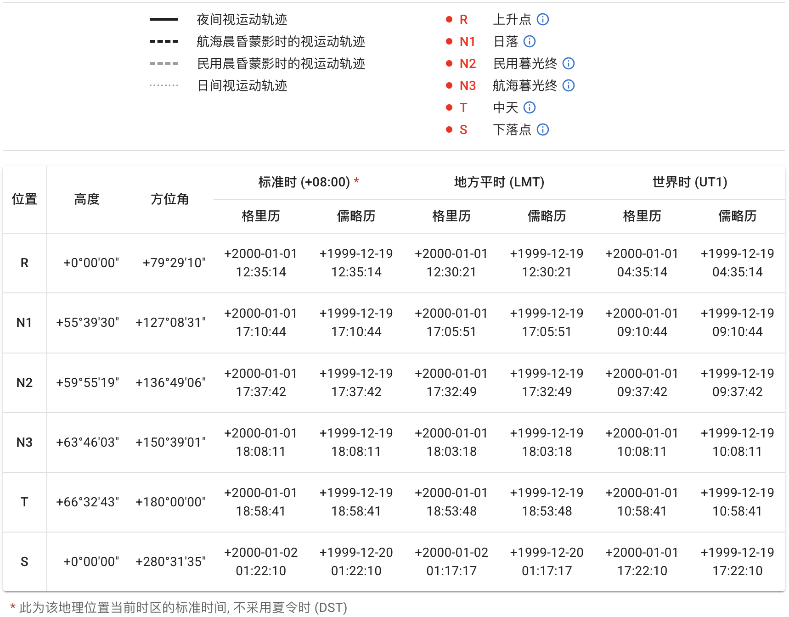
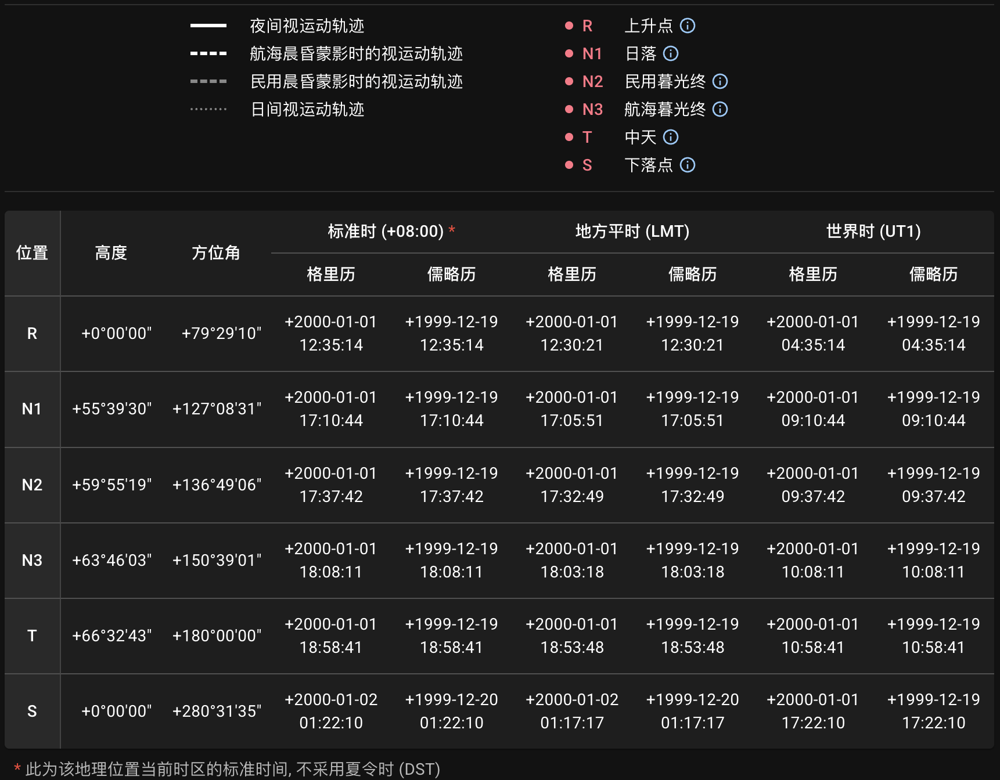

## 视运动轨迹地平坐标投影图

点击`绘制星轨`按钮发送请求后，服务器会以图片和表格形式返回结果。查询的地点、日期、天体等信息将显示在图像上方。

图像采用[地平坐标系][horizontal coordinate system]。[南北天极][north and south celestial poles]、[天顶][zenith]如果在坐标范围内，将分别标记为 `NCP`、`SCP` 和 `Z`。
{ .img-light } { .img-dark }

::: callout tip "农历日期"
如果该查询日期可被转换为农历日期，将显示为浮动提示。鼠标悬浮在显示的日期上（在移动端则轻触）即可看到提示。
{ .img-light } { .img-dark }
:::

::: callout info "如果天体未升起"
如果对所选地点和日期，查询的天体未曾升起，将显示提示：
{ .img-light } { .img-dark }
:::

[horizontal coordinate system]: https://zh.wikipedia.org/wiki/%E5%9C%B0%E5%B9%B3%E5%9D%90%E6%A8%99%E7%B3%BB
[north and south celestial poles]: https://zh.wikipedia.org/wiki/%E5%A4%A9%E6%A5%B5
[zenith]: https://zh.wikipedia.org/wiki/%E5%A4%A9%E9%A0%82

## 图例和数据表格

图中的星轨根据不同晨昏阶段使用不同线型绘制以便区分。所选天体在升落和中天的位置也标记在图中。图片下方附带了图例和数据表格供参考。表格中包含了这些标记位置的相应坐标和时刻。
{ .img-light } { .img-dark }

::: callout tip "标记点说明"
鼠标悬浮在 **ⓘ** 符号上（在移动端则轻触）可打开相应标记点的解释。
{ .img-light } { .img-dark }
:::

## 下载

生成的图像可导出为 `SVG`、`PNG` 或 `PDF` 格式。表格可导出为 `CSV`、`JSON` 或 `XLSX` 格式。

::: callout info "元数据"
查询信息将以元数据的形式嵌入 `SVG` 文件：

```xml
<metadata>
  <title>sp_1777589177.716</title>
  <desc>Date (Gregorian): +2000-01-01</desc>
  <desc>Location (lat/lng): 32.055/118.779</desc>
  <desc>Celestial Object: Jupiter</desc>
</metadata>
```

或嵌入到 `PDF` 文档属性的 `描述` 部分：

```text
Location (lat/lng): 32.055/118.779,
Date (Gregorian): +2000-01-01,
Celestial Object: Jupiter
```

:::
