选用以下方法指定天体。

## 选择行星 {#select-planet}

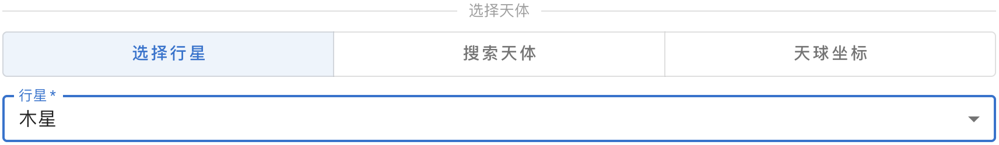{ .img-light } 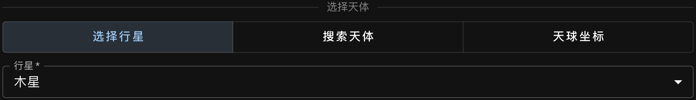{ .img-dark }

## 指定依巴谷星表编号 (HIP) {#search-hip}

### 检索编号 {#search-hip-by-number}

输入数字以检索编号，然后从下拉列表中选择一个条目。
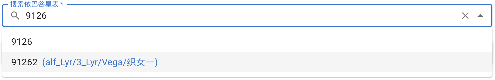{ .img-light } 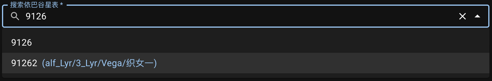{ .img-dark }

如上所示，如果候选条目的数据中包含任何[拜耳星名][Bayer designation]、[专有名称][proper name]或中文名，将同时显示在编号旁以供参考。

::: callout info "可检索的依巴谷星表编号范围"
我们从[依巴谷星表数据源][HIP data]中筛选的可供检索的编号范围为 `1` 至 `118322`。尽管原表中存在编号更大的天体，但它们的信息不完整且几乎不会被用到，因此我们排除了这些条目。

如果某天体的编号在可检索范围内却缺乏所需信息，将会给出相应提醒：
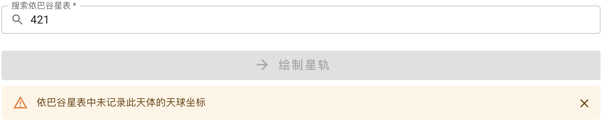{ .img-light } 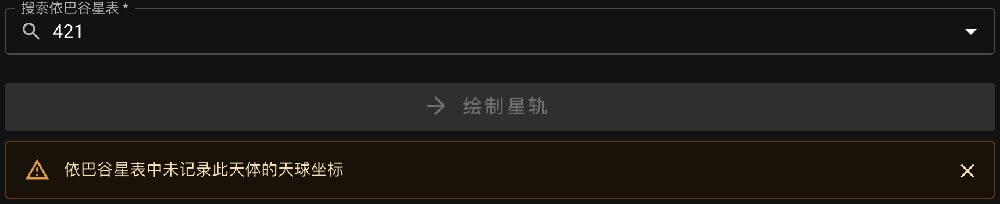{ .img-dark } 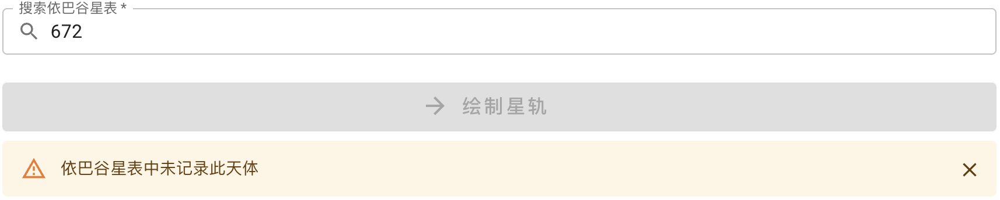{ .img-light } 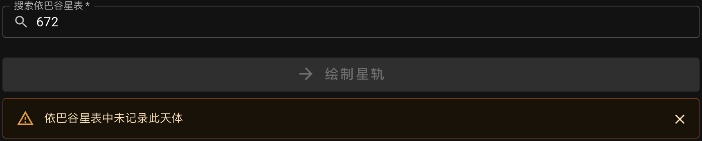{ .img-dark }

[Bayer designation]: external:https://zh.wikipedia.org/wiki/%E6%8B%9C%E8%80%B3%E5%91%BD%E5%90%8D%E6%B3%95
[proper name]: external:https://zh.wikipedia.org/wiki/%E6%81%86%E6%98%9F%E5%91%BD%E5%90%8D
[HIP data]: external:https://cdsarc.cds.unistra.fr/ftp/cats/I/239

:::

### 通过专有名称或拜耳星名检索编号 {#search-hip-by-name}

输入**专有名称**或**拜耳星名**（不区分大小写），然后从下拉列表中选择一个条目以获取编号。
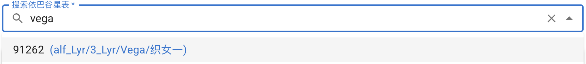{ .img-light } 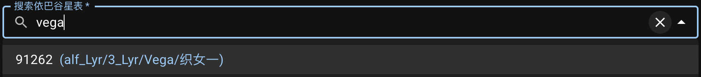{ .img-dark }

::: callout info "希腊字母与拉丁缩写对照表"
本应用中拜耳星名的格式参考了数据源中的格式（数据源见[引用资源][Resources]）。

```text
α → alf   β → bet   γ → gam   δ → del     ε → eps   ζ → zet
η → eta   θ → the   ι → iot   κ → kap     λ → lam   μ → mu
ν → nu    ξ → ksi   ο → omi   π → pi      ρ → rho   σ → sig
τ → tau   υ → ups   φ → phi   χ → chi/xi  ψ → psi   ω → ome
```

[Resources]: ../resources/#bayer-designation-and-proper-name

:::

### 通过中文星名检索编号 {#search-hip-by-chinese-name}

输入**简体中文**、**繁体中文**或**拼音**，然后从下拉列表中选择一个条目以获取编号。
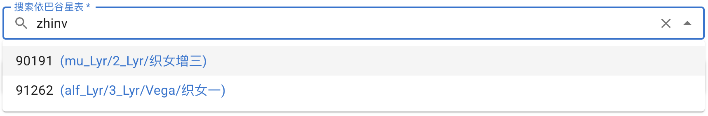{ .img-light } 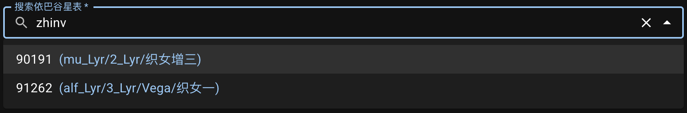{ .img-dark }

::: callout tip "拼音输入"
使用拼音进行输入时，字之间不含空格。为了让显示更紧凑，结果中显示的拼音也不含空格。

拼写时 `ü` 可用 `v`、`yu` 或 `u` 表示。
:::

::: callout info "自行"
使用依巴谷星表指定天体时，星轨计算中考虑了[自行][Proper motion]。

[Proper motion]: external:https://zh.wikipedia.org/wiki/%E8%87%AA%E8%A1%8C

:::

## 指定天球坐标 {#enter-radec}

可通过输入[国际天球参考系（ICRS）][ICRS]（J2000）的[赤经][RA]和[赤纬][Dec]坐标来跟踪天球上一个固定的点。

输入格式可选择**赤经**用**时·分·秒（HMS）**、**赤纬**用**度·分·秒（DMS）**：
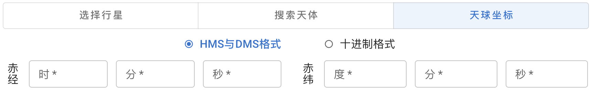{ .img-light } 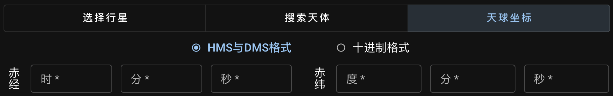{ .img-dark }
或都使用**十进制小数**：
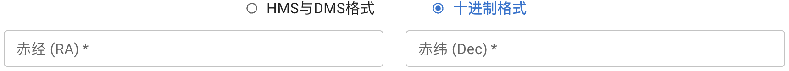{ .img-light } 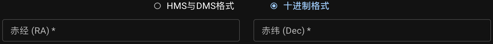{ .img-dark }

::: callout info "无自行"
使用赤经赤纬指定观测目标时，星轨计算中不考虑自行，因为该坐标点可能不对应任何天体。
:::

[ICRS]: external:https://science.nasa.gov/learn/basics-of-space-flight/chapter2-2/
[RA]: external:https://zh.wikipedia.org/wiki/%E8%B5%A4%E7%BB%8F
[Dec]: external:https://zh.wikipedia.org/wiki/%E8%B5%A4%E7%BA%AC
