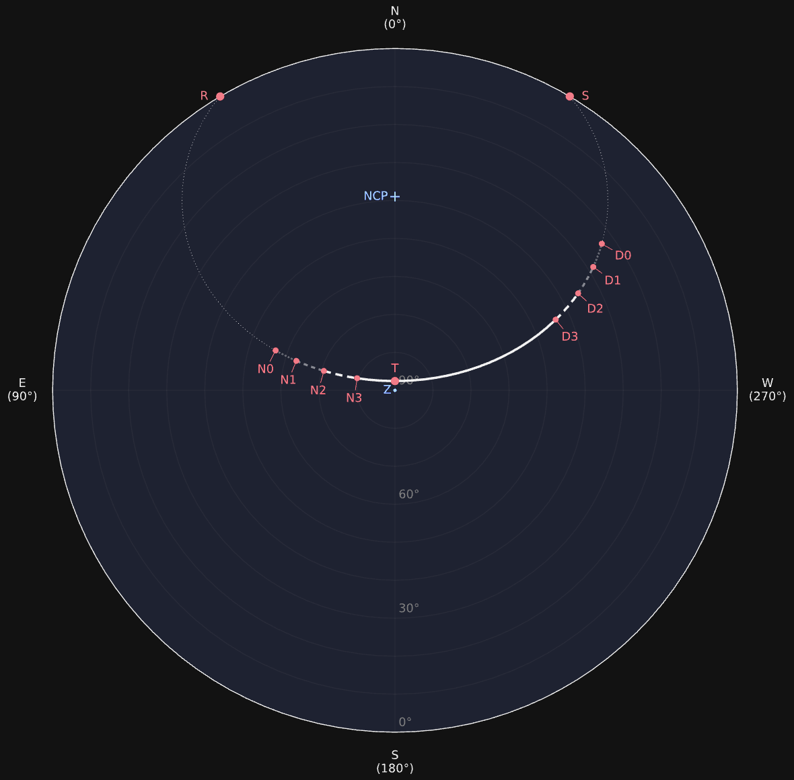
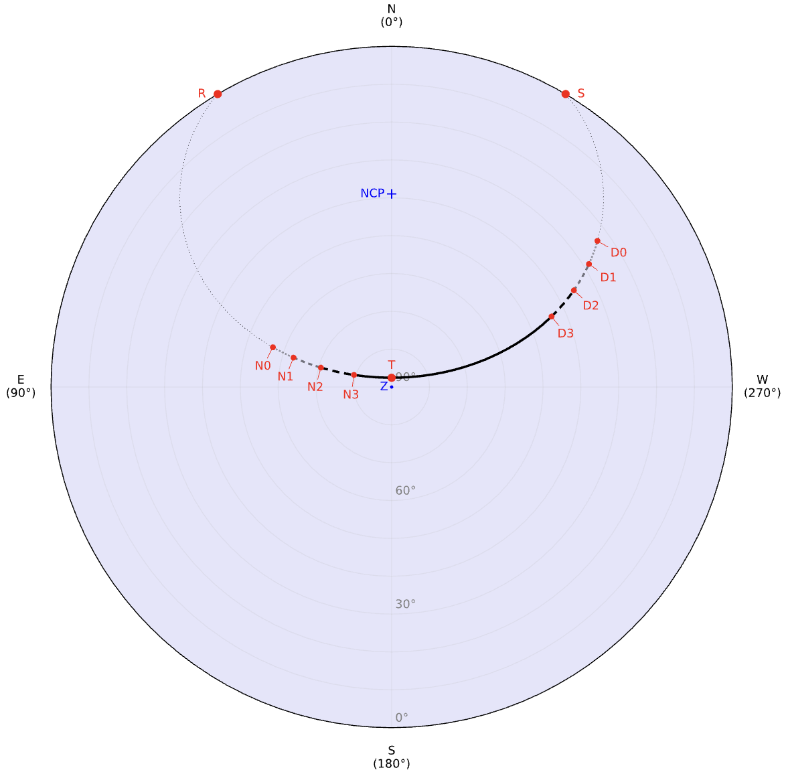

::: hero layout:split glow:false

# Star Path Viewer

全天星轨追踪在线天文工具

::: button "使用指南" ./guides/location.md icon:telescope
::: button "GitHub" external:https://github.com/stardial-astro/star-path-viewer color:#333 icon:github

== side

:::

## :rocket: 开始 {#quick-start}

[Star Path Viewer][] 根据输入信息计算选定天体于一天之内在天球上的[视运动][apparent motion]轨迹。生成的结果包含一个展示星轨的[地平坐标系][horizontal coordinate system]投影图以及一个包含升落、中天、晨昏蒙影数据的表格。

**第一步：** 指定[`地理位置`][Location Input]、[`当地日期`][Date Input]并[`选择天体`][Star Input]。

**第二步：** 点击[`绘制星轨`][Draw]按钮。结果将显示在按钮下方。

::: callout tip "除此之外，也可作为便捷小工具使用"
:bulb: 这个地点的**经纬度**是多少？→ [搜索地址][Search Address]
:bulb: 今年的**春分/夏至/秋分/冬至**是哪天？→ [二分二至][Quick Entry]
:bulb: 这颗星的**依巴谷星表编号**是多少？→ [搜索星名/依巴谷星表][HIP]
:bulb: 这颗星的**中文名**是什么？→ [搜索中文星名][Chinese name]
:bulb: 今晚什么时间天色足够暗到能看到**极光/流星雨**→ [查看日落和黄昏时刻][Anno]
:bulb: 我该如何规划**天文摄影**的时间？→ [查看晨昏蒙影时刻][Anno]

[Search Address]: ./guides/location/#search-address
[Quick Entry]: ./guides/date/#look-up-season
[HIP]: ./guides/star/#search-hip-by-number
[Chinese name]: ./guides/star/#search-hip-by-chinese-name
[Anno]: ./guides/results/#legend-and-table

:::

[Star Path Viewer]: external:https://star-path-viewer.pages.dev/
[apparent motion]: external:https://zh.wikipedia.org/wiki/%E5%91%A8%E6%97%A5%E9%81%8B%E5%8B%95
[horizontal coordinate system]: external:https://zh.wikipedia.org/wiki/%E5%9C%B0%E5%B9%B3%E5%9D%90%E6%A8%99%E7%B3%BB
[Location Input]: ./guides/location
[Date Input]: ./guides/date
[Star Input]: ./guides/star
[Draw]: ./guides/results

## :sparkles: 功能亮点 {#highlights}

::: grids
::: grid
::: card "跨越古今" icon:pyramid
支持查询**公元前3001年**至**公元3000年**间任意一天。
:::
:::
::: grid
::: card "权威数据" icon:atom
基于全球天文机构**权威数据源**和**专业科学库**精心构建。
:::
:::
::: grid
::: card "直观呈现" icon:sparkles
描绘直观完整的全天**星轨**图像，并配以明晰的**注释**。
:::
:::
::: grid
::: card "晨昏蒙影" icon:sunset
标记天体**升落**和**过中天**的时刻及其在不同**晨昏蒙影**阶段的位置。
:::
:::
::: grid
::: card "多种日历" icon:calendars
支持**格里历**与**儒略历**日期输入与显示，同时支持**农历**日期显示。
:::
:::
::: grid
::: card "二分二至" icon:zodiac-aries
指定年份和地点可便捷获得**春分**、**夏至**、**秋分**和**冬至**日期。
:::
:::
:::
